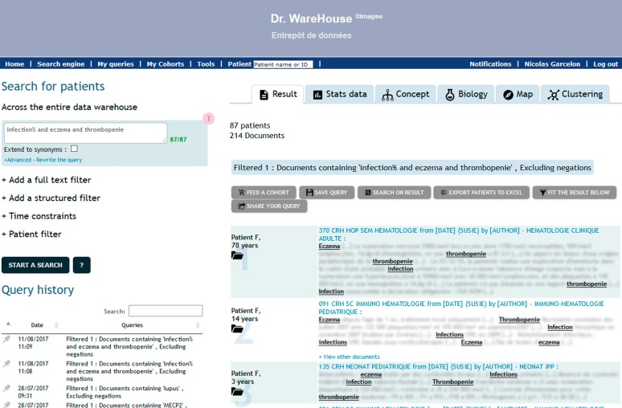
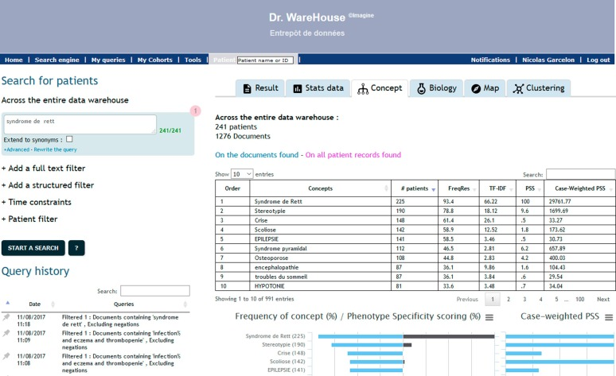
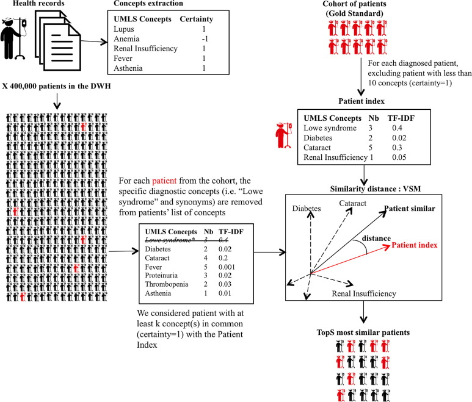

# Motivation
Extraire les données des comptes-rendus
- EScudié et al, 2017 : 79% des comorbidites trouvées seulement dans le texte pour  740 patients
- Necker : 640 000 patients, 5M comptes-rendus

Non testé !

Source: Garselon et al, 2018 Journal of Biomedical Informatics

# Trouver des patients

# Fouille de données : phénotypage 

# Fouille de données : phénotypage 

Note du phénotype pour 6 malaides par un humain

Sets  	                                RETT 	DOCK8 deficiency 	LOWE 	SILVER RUSSELL 	BARDET BIEDL 	APDS 1 and 2
-----                                   ------ --------------------- --------- ---------------- ------------- -----------------
Average Precision, ranked by TF-IDF 	0.91 	0.84                 	0.90 	0.49           	0.52          	0.83 
Couvrture orphanet                   	0.71 	0.70                  	0.66 	1.00 	         0.82 	– 

activated phosphoinositide 3-kinase-δ (PI3Kδ) syndrome (APDS) 

Source: Garselon et al, 2018 Orphanet Journal of Rare Diseases 

# Recherche: patients avec phénotype similaire (errance diagnostic)

Algorithme de similarité : Garselon et al, 2017 (Journal of Biomedical Informatics)

# 

Démo possible
