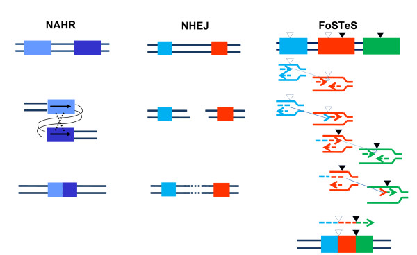
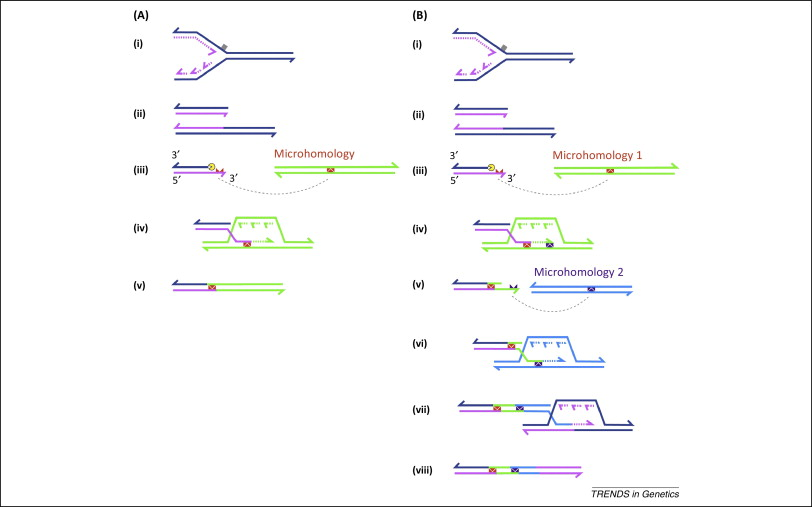

# Mécanismes
#cyto

## Anomalies de structure
- Récurrents : bornes identiques
  - Non-allelic homologuous recombination (NAHR) . Il faut 2 duplications segmentaires 
    -> ex de la microdel 22q11.2
  - cassures régions riches en AT
- Non-récurrents : bornes variables :
  - Non homologuous end-joining (NHEJ)
  - Microhomology-mediated break ieduced replication (MMBIR)
  - Interruption de la fourche de réplication (FoSTeS)

  NAHR, NHEJ, FoSTeS
  
  MMBIR
