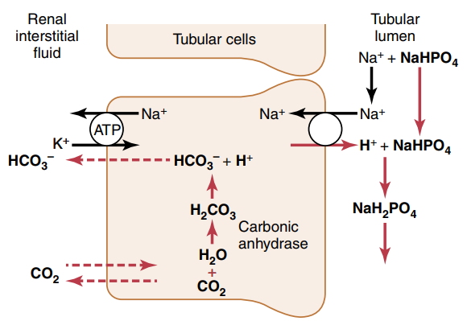

# Acide-base 

3 mécanisme de défense :

-   tampon = quelques secondes (combine à une acide ou base)
-   poumon = quelques minutes (supprimer CO~2~)
-   rein = quelques heures/jours (excrète urine acide/alcaline)

## Tampon

Buffer + H^+^ ↔ H Buffer

### Bicarbonate

$CO_2 + H_2O \leftrightarrow H_2 CO_3 \leftrightarrow H^{+} + HCO_3^{-}$
avec carbonic anhydrase (alvéoles pulmonaires, )

-   Acidose : tampon du H^+^ de l'acide avec HCO~3~^-^ pour produire
    CO~2~ et H~2O~. Le CO~2~ est éliminé par le poumon. Exemple : HCl
    -\> H^+^ + Cl^-^

-   alcalose : tampon du OH^-^ avec H~2~ CO~3~ pour former du HCO~3~^-^,
    qui sera excrété au niveau rénal

    *NB*: le CO~2~ dans le sang est proportionnel à la pCO~2~: CO~2~ =
    0.03 p~CO~2~~

**C'est le tampon extracellulaire le plus important.** En effet,
l'efficacité est maximale pour pH = pK mais le pK est à 6.1 pour un pH
extracellulaire de 7.4. Ce paradoxe est résolu par la régulation du pH
extracellulaire par les reins et les poumons.

### Phosphate

-   Si acidose : acide remplacé par NaH~2~ PO4 (acide plus faible)
-   Si alcalose : base remplacé par Na2H PO4 (base plus faible)

Le pK est proche du pH 6.8 vs 7.4 mais la concentration extracellulaire
est faible donc la capacité de tampon est moindre que celle des
bicarbonates. **Il est très important dans les tubules rénaux** :
concentration impportante de phosphate à cet endroit et le pH est
nettement diminué (proche du pK donc idéale)

### Protéines

60-70% du tampon total se fait dans le cellules et la plupart vient des
protéines intracellulaire

Le pH intracellulaire \"suit\" le pH extracellulaire dans les heures qui
suivent (diffusion lentes H^+^ et HCO~3~-)

## Respiration

Le CO~2~ est formé de manière continue par les processus métaboliques
intracellulaires. Il va ensuite diffuser dans le sang et liquides
interstitiels puis transporté dans les alvéoles. La ventilation
pulmonaire va le transférer dans l'atomosphère.

-   Acidose -\> Hyperventilation -\> diminution CO~2~ -\> diminution
    H^+^ -\> alcalose. Doublement de la fréquence respiratoire = pH +
    0.23
-   Alcalose -\> hypoventilation mais moins efficace car l'hypoxémie
    active les chémorecepteurs qui vont stimuler la respiration

La réponse respiratoire est efficace à 50-70%. Elle este 1 à 2x plus
efficace que les tampons extra-cellulaire. Évidemment, réponse diminuée
par une anomalie de la fonction respiratoire (emphysème...)

## Rénal

Production d'acides non volatiles (protéines surtout) qui ne sont pas
éliminables par la respiration Le rein doit également éviter la perte de
bicarbonates -\> quasiment tout est réabsorbé. Pour cela, il faut une
excrétion de H^+^ pour réabsorber le HCO~3~^-^ filtré

Alcalose -\> diminution sécrétion H^+^ -\> diminution réabsorption
bicarbonates Acidose -\> augmentation sécrétion H^+^ -\> augmentation
réabsorption et production des bicarbonates

### Sécrétion H^+^ et réabsorption bicarbonates

**Pour chaque bicarbonates réabsorbé, il faut produire un H^+^**

90% tubule proximal

Pour réabsorber les bicarbonates, ils vont être combinés aux H^+^
sécrétes,form ant du H~2~ CO~3~, décomposé en CO~2~ et H~2O~. Le CO2 va
pouvoir passer la membrane tubulaire et converti en HCO~3~^-^ qui va
être réabsorbé dans le sang: via le Na+ - HCO~3~- (tubule proximal) ou
Cl- HCO 3\^- (autres parties)

{#Sécrétion H^{+} et réabsorption bicarbonates : tubule}

**Le bilan net d'une excrétion d' H^+^ est donc seulement la
réabsorption de HCO~3~^-^** En temps normal, il y a un légèr excès
d'excrétion H^+^ sur HCO~3~^-^ dans les tubules. H^+^ est combiné avec
les phosphates et l'ammoniaque.o Si HCO~3~^-^ \> H^+^ dans les urines,
il est excrété. Si H^+^ \> HCO~3~^-^ dans les urines, il est excrété
avec phosphate et ammionaque.

Il y a un second type de cellule qui permet d'excréter du H^+^ avec une
pompe \"active\" plutôt qu'un contre-transport. Ce mécanisme produit peu
de quantité d'H^+^ mais permet de concentrer forcement les ions H^+^

{#Sécrétion active H^{+}  : tubule}

### Génération de HCO~3~^-^

Une fois que tous le HCO~3~^-^ a été réabsorbé, l'excès de H^+^ se
combine avec le phosphate HPO~4~\^=
 **Quand un H^+^
supplémentaire se combine avec autre chose qu'un bicarbonate, il y a un
gain net d'un bicarbonate**

La plupart du phosphate est réabsorbé donc le tampon se fait surtout via
l'ammoniaque (NH3 et ion NF3)

Dans le tubule proximale, NH~4~^+^+ est synthétisé depuis la glutamine
(métabolisme des acide aminés dans le foie) selon : glutamine -\>
2NH~4~^+^ + 2 HCO~3~^-^ Les 2 NH~4~^+^+ sont sécrétés et les 2
bicarbonate sont réabsorbés, **créant de nouveaux bicarbonates**

Dans le tubule collecteur, le H^+^ va se combiner avec NH~3~ pour former
du NH~4~^+^

**Pour l'acidose chronique, l'excrétion de NH~4~^+^ est le mécanisme
dominant**

### Calcul net

Excrétion d'acide par le rein = excrétion NH~4~^+^ + buffer non
bicarbonate et non ammonique - réabsorbtion H^+^ dans le sang =
excrétion NH~4~^+^+ {buffer autre que les bicarbonate et l'ammoniaque} -
excrétion HCO~3~^-^

-   Acide = excrétion \> 0
-   Alcalose = excrétion \< 0

### Régulation sécrétion H^+^

Il en faut suffisament pour réabsorber le HCO~3~^-^ filtrer et excréter
NH~4~^+^+ (acide non volatide)

-   Alcalose : diminution sécrétion H^+^ pour réabsorber moins de
    HCO~3~^-^
-   Acidose : augmentation sécrétion H^+^ pour réabsorber tout le
    HCO~3~^-^ et pouvoir excréter des H^+^ (donc augmenter les
    HCO~3~^-^)

Sécrétion H^+^ augmentée par

1.  augmentation pCO~2~
2.  diminution \[H^+^\] extracellulaire
3.  hypersécrétion aldostérone (donc alcalose en pratique)
4.  Stimulation réabsorbtion sodium (réabsorbé en même temps):
    hypovolymie, diminution angiotensine
5.  Hypokaliémie

Diminuée par l'inverse

### Cause et correction

Acidose

-   métabolique : du à diminution \[HCO~3~^-^ extracellulaire\]
-   respiratoire : augmentation pCO2 extracellulaire (stimule sécrétion
    H^+^)

-\> chronique: augmentation production NH~4~^+^+ (donc augmentation
excrétion H^+^ et ajout HCO~3~^-^ sang). si métabolique, les poumons
aident à corriger

Alcalose =

-   respiratoire : causé par diminution pCO~2~ plasmatique
    (hyperventilation). Réponse: diminution sécrétion H^+^ -\>
    augmentation excrétion rénale HCO~3~^-^ car ne peut être réabsorbé
-   métabolique : diminution \[H\^+\] causé par une augmentation de
    \[HCO~3~\^+\]. Réponse : hypoventilation (dimine partiellement pH) +
    augmentation filtration HCO~3~^-^

### Étiologies

-   Acidose respiratoire : hypoventilation (obtsruction respiratoire,
    atteinte centre respiratoire...)
-   Alcalose respiratoire : hyperventilation (psy, altitude)
-   Acidose métabolique:
    -   acidose rénale tubulaire : diminution de la réabsorbtion rénale
        de bicarbonates, diminution excrétion H^+^
    -   diarrhée : perte de bicarbonates dans les selles
    -   vomissement intestinal = perte bicarbonates
    -   diabète : formation acide acido-acétique à partir de lipides
    -   ingestion acide (aspirine)
    -   insuffisance rénale chronique (anions des acides faibles non
        excrétés, diminution excrétion phosphates NH~4~^+^)

    Trou anonionique :
-   augmenté (chlorémie normale)
    -   diabète
    -   insuffisance rénale chronique
    -   Aspirine, méthanol, éthylène glycol,
    -   acidose lactique,
-   normal (hyperchlorémie)
    -   diarrhée
    -   Addison
    -   inhibiteur anhydrase carbonique
    -   acidose rénale tubulaire
-   Alcalose métabolique:
    -   diurétique : réabsorption sodium (lié à excrétion H^+^,
        aldostérone et angiontensione par réduction volume
        extracellulaire)
    -   excès aldostérone (stimule sécrétion H^+^ et réabsorption
        HCO~3~^-^)
    -   vomissement gastrique = perte acide (HCL), à différence de
        vomissements intestinaux
    -   médicaments alcalins

### Traitement

-   acidose = sodium bicarbonate oral, sodium lactate/gluconate IV
    (moins dangereux que bicarbonates en IV)
-   alcaloe : chloride ammonium oral (pas en IV !)
