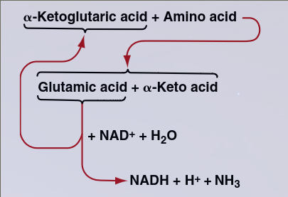
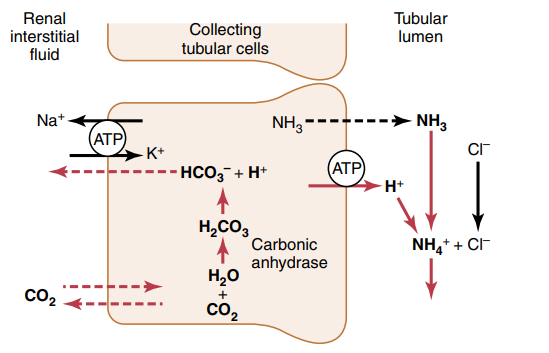
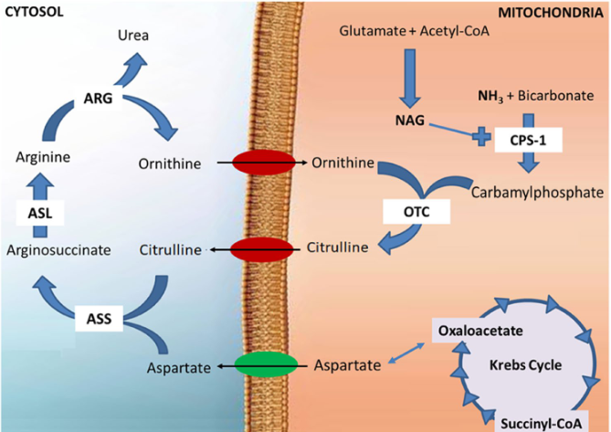

## Dosage

-   2 formes : NH~3~ (gaz), NH~4~^+^ (majoritaire)
-   Hautement toxique en excès -\> élimination sous formne d\'urée

## Ammionac : Fonction

-   source de nitrogène pour la synthèse des protéines + composés
    essentiels
-   maintien du pH

## Ammionac : Production

-   Intestin : digestion des protéine + désamination
-   Rein : excrété dans les urine / sang (désamination de glutamine)

Dégradation des acides aminés (pour énergie ou stockage sous forme de
graisse/glycogène) -\> désamination dans le foie

Transamination : le groupe amine est transféré vers l\'acide
α-ketaglutarique qui devient l\'acide glutamique

L\'acide glutamique peut transférer son groupe amine également ou le
largue sous forme d\'ammoniac NH~3~

## Ammionaque : Vie

Introduit dans les acides aminés par la glutamine synthetase ou
glutamate dehydrogenase Sous forme de glutamine, va être transporté dans
le sang Glutamate + ATP + NH3 = glutamine + ADP+ P Principal moyen
d\'échanger des groupes amines entre les différents organes

## Ammionaque : Vie : pH

Tubule collecteur : H^+^ sécrété va se combiner à NH~3~ pour excréter
ion ammoniaque. Un ion biocarbonate va retourner dans le sang

Acide : augmentnation de la sécrétion d\'ion ammoniaque

## Ammionaque : Mort

1.  Extra-hépatique : Formation de glutamine : ammonia + glutamate -\>
    glutamine (enzyme = glutamine synthetase) qui sera transportée dans
    le foie Note: dans le cerveau, pas de formation d\'urée donc c\'est
    le même mécanisme !

2.  Intra-hépatique : cycle de l\'urée = converti en urée

## Ammionaque : Mort : cycle de l\'urée

Mitochondrie foie : ammoniac + bicarbonate catalés par cPS1
(carbamylphosphate synthase 1) (Celle-ci provient du glutamate +
acetylco) Le produit est transformé en citrulline avec l\'ornithine

Dans le cytosole hépatique : convertin en acide aminé (arginine)o à
l\'aide de 2 cataliste : ASS1 (argininosuccinate synthase 1) et ASL
(argininonsuccinate lyase)

Arginine est clivée en urée et ornithine et regénère ornithine qui
permet de redémarrer le cycle
