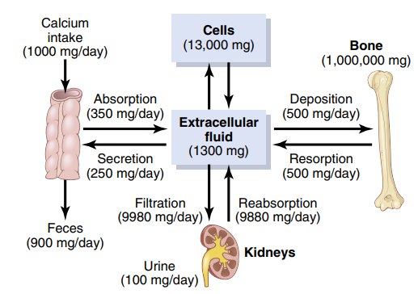

#biochimie
## Intérêt (Guyton)

Régulation fine calcémie

-   contraction musculaire (squelettique, cardiaque, muscle lisse)
-   coagulation
-   transmission nerveuse

Hypocalcémie= hyperexcitation (tétanie, épilepsie) car augmentation la
perméabilité membrane neuronale au sodium Hypercalcémie= hypoexcitation,

## Calcium

### Métabolisme calcium

99% squelette

Calcémie totale =

-   no diffusible (40%) liée aux protéines (surtout albumine)
-   diffusible = calcium ionisé (50%) \[=biologiquement active\] +
    calcium complexé (10%) \[sels de phosphate, oxalate, citatre,
    bicarbonate\]

*NB: calcémie diminue avec le pH* Rénal: Ca^2+^ et calciul soluble no
ionié est filtré mais la quasi-totalité est réabsorbé

{#calcium}

### Régulation

PTH = hypercalcémiant

-   stimulée par le phosphate
-   inhibée par le calcitriol

 Vitamine D = hypercalcémiant

-   absorption intestinale
-   résorption osseuses
-   rétroncontrôle négatif PTH

{#vitamine D}

calcitonine = effet opposé PTH mais moindre

### Résumé

1.  Os = 1ere ligne de défense via des sels de calcium dans les os
    (0.5-1%)
    -   hypercalcémie -\> dépôts de ces sels

    -   hypocalcémie -\> asbsorption 50% de l'excès de calcium peut être
        absorbé en 70%

        Mitochondriea (foie, intestant) = tampon additional
2.  Hormonal : diminution PTH dans 3min après hypercalcémie,
    augmentation calcitonine

## Phosphore

### Métabolisme

85% os Le phosphore sanguin = 90 hématies. Dans le plasma :

-   organique (15%) = phospholipides
-   minérale = ions de l'acide orthophosphorique

Élimination selles et surtout dans les urines (réabsorbtion partielle
dans le tubule proximal) Régulation = équilibre absorption intestninale,
réabsorbtion rénale, échange os \<-\> extracellulaire

-   FGF-23 = augmente excrétunio urinaire
    -   diminue réabsorbtion rénale
    -   synthèse calcitriol
    -   stimule inactivation calcitriol, 25-OH-D

## Magnésium

nécessaire à la sécrétion de PTH par parathyroïde

## Dosage

référence = calcium ionisé mais augmenté si acidose, diminué si
hypophosphatémie

-   Hypo/hypercalciméie : dosier calcémie, et phosphate
-   fragilité osseuse/lithiases rénale/néphrocalcinose : calcémie,
    phosphatémie, créatininémie, PTH, 25OH vitamine D, calciurie 24h

### Calcémie

-   à jeun
-   très sensible à l'albumine : plusieurs formules (imparfaites)
    -   corrigé = total + 0.02 × (4\*-albuminémie) si albuminémie \<
        40g/L
    -   liaison Ca^2+^ - albumine fortement dépendant du pH
        (proportionnel)

### Calciurie

-   à adapter selon le poids, apport (alimentaire + médicament)
-   plus élevée chez femmes ménoposée

### Calcium/créat urinaire

= dégradationosseuse

### Phosphate

0.80-1.45mmol/L chez l'adulte hémolyse = augmentation phosphotaes (GR
riches en phosphase)

Capacité du rein à réabsorber le phosphate

-   Taux de réabsorption du phosphate = 1 -
    `\frac{phosphaturie \times créatininémie}{phosphatémie \times créatininurie}`{=latex})
-   TmP/DFG = seuil maximum de rabosorption du phosphate -\> calculé à
    partir du TRP, phosphatémie et abaque

### PTH

immunoenzymatique. ne dose pas la PTHrp

### Vitamine D

-   25OHD =routine
-   1,2)OH~2~ D = difficulie, 2e indication

## Pathologies

### Parathyroïde

1.  Hyperparathyroïdie primaire

    -   Production inappropriée PTH.
    -   Fréquent, surtout féminin, asymptomatique/aspécifique
    -   Étiologies : adénome(s) parathyroïdes, hyperplasie autonomisée
        des 4 glandes parathyroïde, carcinome parathyroïdien (rare), NEM
        (1 surtout, 2)
    -   Diagnostic = biologique +/- scinti/échographie
        -   hypercalcémie, hypercalciuire
        -   +/- hypophosphatémie
        -   1,25(OH)2 D + marqueur remodelage ossex
    -   attention: PTH peut être normale haute. On peur avoir une HPP
        normocalcémique
    -   Diagnostic différentiel = hypercalcémie-hypocalciurie familiale
        bénignie (*CaSR*, *AP2S1*, *GNA11*) : hypocalciurie relative
    -   Traitement : chirurgical mais non systémiatique

2.  (Pseudo)Hypoparathyroïdie

    -   Hypoparathyroïdie = défaut synthèse PTH avec hypocalcémie, PTH
        basse/normale basse, phosphatémie haute/normale haut, calciurie
        le plus souven normale
    -   Pseudo-hypoparathyroïdie = résistance = hypocalcémie,
        hyperphospatméie mais PTH élevée
        -   microdel chr22 (di george), chirirguie, hypomangésémie
            chronique

### AVitamine D

Surcharge

-   intox vitamine D = très rares mais sévère. Génère hypercalcémie, que
    le rein essaye de compenser en augmentant la calciurie.
    L'hypercalcémie apparaït qand le rein est débordé 25OHd \> 150ng/mL
-   granulomatose (sarcoïdose): les cellulels du granulome (=
    macrophages + descendants) peuvent hydroxyler la 25OHD circulante et
    relarger la 1,25OH2D
    -   hypercalcémie, PTH basse, hypercalciurie, 25OHD normale et
        1,25OHd élevé, enzyme de conversion angiotensine élevée
-   hypersensibilité vitamine D : récessive, *CYP24A1*

Carence = rachitismie, ostémalacie

-   défaut d'absorption calcium, phosphore -\> hypercalcémie avec
    augmentation PTH -\> calcium normal mais tensadance à
    hypophosphatémie -\> défaut de minéralisation avec élévation PAL

Également, stimulation production éranle de 1,25OHD2, mais s'arrête
quand il n'y a plus de 25OHD -\> grave !

-   alimntation très riche en fibres /phytate (inhibe absorption
    intestinale calcium !!)
-   situation de résisstance : type 1, 2, 3

### Hyperparathyroïde secondaier IRC

-   PTH élevée, hyperphosatémie, hypocalcémie, déficit calcitriol
    -   Mécanisme : IRC -\>
        -   diminution synthèse rénale calcitriol
            -   dimination absorption intestinale phosphate + calcium
        -   rétentation phosphates -\> aumentation FGGH23 -\> augmente
            excrétion urinaire phosphate + diminution synthèse réranle
            calcitriol (cf supra)

### trouble réabsorbtion rénale duphosphate : diabète phosphaté

hypophosphatémie, calcémie normale

-   rachitisme héréditaire hypophoshatémique = fuite rénale de phosphate
    (Tmp/DFG bas) avec PTH normale / légèmenet élevée. Déficite relative
    en calcitriol qui aggrave hypophosahtémie
-   ostémolacalie tumorale hypophosathméique = production FGh23 par
    dtumeux mésenchymateusebénignise : cf supra pour la biologie avec
    1,25OH2D normale/basse donc inadaptée

### tumorale

sécrétion d'une substance analogue PTH = pepite apparénté PTH -\> se
fixe sur les récepteur PTHR1 et induit effet biochimique PTH -\>
diminution PTH
