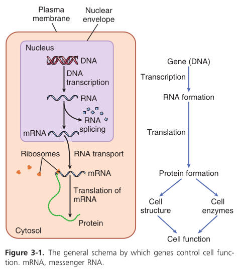

# Consultation

## Première

### Dossier
Général :
- Adresse
- Niveau d'étude
- ATCD
- Désir de grossesse, contraception
Arbre : 
- en partant du cas index
- jusqu'aux grand-parents (préciser la ville d'origine pour une éventuelle consanguinité)
- FCS, IMG (bilan si > 4 FCS)
- nuémroter les frères et soeurs avec détails en dessous (nom, date de naissance, ATCD)

### Interrogatoire
ATCD: handicap (ULIS, CLIS ?), décès avant 65A
HDLM:
- grossesse : spontanée, écho, médicamements, toxiques (not. professionnel), fièvre, voyage
- naissance: terme, méthode, APGAR, poids, taille, PC, 
    (utiliser audiprog pour courbes: noter percentils [notmale = P3-P97, soit -2DS, +2DS)
- développement: 
    - âge des différentes aquisitions (cf echelle de Denver) : assis [sans appui à 9 mois], marche 4 pattes, debout, marche seul [12-18mois], 1er mots [12-18mois], fait ses nuits, propreté [à 2 ans, propre le jour. nocturne = variable])
    - stéréotypie, réveils nocturnes avec cauchemars, sociabilité, trie nourriture, ambiance avec les frères et les soeurs
    - compléter les courbes de croissance (poids, taille, PC)

### Examen
Photos++ : visage F+P des 2 côtés, en slip position anatomique (F+P x2), pieds, mains +/- tâches, anomalies, ongles

### Explication et consentement
Consentement à faire signer
- Si mineur : 3 consentement = 1 pour chaque parent (DNAthèque), 1 pour l'enfant (CGH, DNAthèque)
- révocable à tout moment (oral)
- Expliquer les limites de l'analyse (bilan de débrouillage, probablement négatif, pour ne pas passer à côté d'un grand syndrome, variants, compliqué)
Permission pour photo à faire signer

### Examens à prescrire
CGH = en première intention (=ACPA) pour les CNV
Puis exome (voit "tout")

NB : panels : Lyon pour neuro, Paris pour tout (not. épilepsie, corps calleux), Lille pour la surdité (demander GJB2)
Lyon = exome
Centogène = exome
Essayer de récupérer les fiches cliniques à jour
Pour surdité, récupérer bilan ORL
## Rendu
Si positif, par PH
Faire réexpliquer
## Suivi
- Comment se passe l'école, grandit bien (comparer à la littérature)
- Vérifier que la prise en charge est conforme à la littérature/PNDS
- Refaire photo, poids, taille
# Outils
Nomenclature variant :
NM_GEN.TRANSCRIT:c00X A>B
- NM_GEN = transcrit codone avec GEN le numéro (NP si protéine)
- TRANSCRIT = numéro du transcrit (attention à la numérotation avec centogène)
- c : codant
- 00X : position *dans le transcrit* !
- A>B : mutation. Exemple
  - Leu1567Val : Leucine -> Valine = missense (aka tronquan
  - Leu1567= : synonyme
  - Leu1567* : stop
  - Leu1567- : intron
Site :
- UCSC : "contient tout" mais nécessite un temps d'apprentissage
- VARsome : score pathologique pour les variants. Utile pour les VOUS (variants of unknown significance)
- OMIM : description des syndromes (notamment les modes de transmission). Valeur sûre
- Genereviews : idem mais plus complet et plus à jour
- AMELIE pour faire une revue rapide de la biblio 
- HPO : se faire une idée du syndome, filtrer variant VUS => plutôt utiliser Pubcase finder (liste symptômes)/Monarch/Phenomiser

Score importants : 
- CADD : entre 0 et 40 et patho si > 15. Accesible sur UCSC mais pas sur Varsome
- SIFT/SIFT 4G
- PolypheCSC mais pas sur Varsome. Non accessible sur Varsome

Remarques : toujours vérifier si on est en hg19 ou 38 !

Autres site :
- Genematcher : pour trouver des phénotypes nouveaux sur un gène
- SMART pour les domaines de protéines

### Organisation de l'internat

### Avis réa ped
Au téléphone : préciser clinique, quels syndromes sont sopçonnées
Demander à une des PH d'être référente
Exome en urgence (2 semaines)
Examen clinique avec infirmier/interne + photo

# Biologie

## Structure de l\'ADN et ARN

L\'ADN et l\'ARN sont des acides nucléiques, c\'est-à-dire des chaînes
(polymères) de nucléotide. Un nucléotide est composé de

-   un groupe phosphate
-   une base azotée
    -   parmi guanine, adenine, cytosine et thymine (ADN)
    -   ou guanine, adenine, cytosine et *uracil* (ARN)
-   un sucre formé de 5 atomes de carbones.
    -   soit du ribose pour l\'ARN (Acide *Ribo* Nucléique)
    -   si du désoxyribose pour l\'ADN (Acide *Désoxyribo* Nucléique)


### Architecture

1.  Séquences répétées

2.  Séquences spécifiques

## Rôles de l\'ADN et ARN

 L\'ADN est dans le noyau mais les
réactions chimiques se passent dans le cytoplasme. Il faut donc un
intermédiaire, l\'ARN, qui va permettre le contrôle de ces réactions par
l\'ADN.

### Types d\'ARN

Les ribosomes produisent des protéines dans le [cytoplasme]{.ul} à
l\'aide de l\'**ARN messager** qui contient la séquence à coder, et de
l\'**ARN de transfert** qui transporte les acides aminés (= blocs
servant à construire les protéines). Les ribosomes servent donc
d\'\"usine\" de production dans le cytoplasme.

```{=org}
#+attr_html: :width 400 px
```
 L\'**ARN ribosomal** construit des blocs de
base des ribosomes dans le nucléole (appartenant au noyau) mais les
ribosomes seront finis d\'être assemblés dans le cytoplysme

Le **micro-ARN** ne code pas mais sert à réguler l\'expression des
gènes. Il va se placer sur une parte de l\'ARN messager avant le
\"traitement\" par le ribosome et va désactiver la traduction de cette
partie. *NB: il existe des versions synthétiques des micro-ARN
(silencing ARN en anglais)*

## Contrôle de l\'activié génétique

### Régulation génétique

Toutes les cellules contiennent le même code génétique mais les gềnes
exprimés ne sont pas les même (myocyte VS cellule rénale).
L\'\"expression\" se juge en fonction de la production des protéines
(qui sont les \"agents\" de l\'ADN)

-   \"Promoteur\" basal = le point de départ de la transcription. Or ce
    promoteur est influencé par un autre promoteur, en amont, qui va
    l\'influencer via des protéines. Et va donc influencer la
    traduction.
-   enhancer
-   insulators : sépare les gènes désactivés des gènes activés

## Mitose et meiose

{width="400 px"}

## PCR

{width="400 px"}

# Syndromes

## Anomalies de nombres de gonosomes

### Turner

-   45, X
-   1/2500
-   naissance:
    -   petite taille, lymphoedème des mains et pieds, excès de peau au
        niveau de la nque
    -   coarctation de l\'aorte, rein en fer à cheval
-   enfance : petite taille
-   ado : aménorrhée primaire
-   Pas de déficience intellectuelle (sauf rares cas)
-   Grossesse possible (don d\'ovocyte + surveillance)

### Klinefelter

-   47, XXY
-   1/700 et 1/1000
-   diagnostic à la puberté : petit volumes testiculaire +/- signes
    hypogonadismes Découvert sur infertilité surtout
-   Nombreuses mosaïque

### 47,XXX

-   1/1000
-   fertilité, morphologie normale, QI légèrement diminué
-   taille supérieure moyenne

### XXX

-   1/1000
-   fertilité, morphologie normale, QI légèrement diminué
-   taille supérieure moyenne


