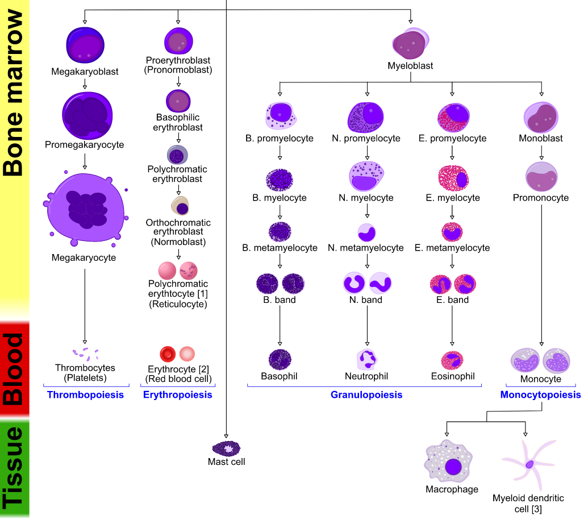
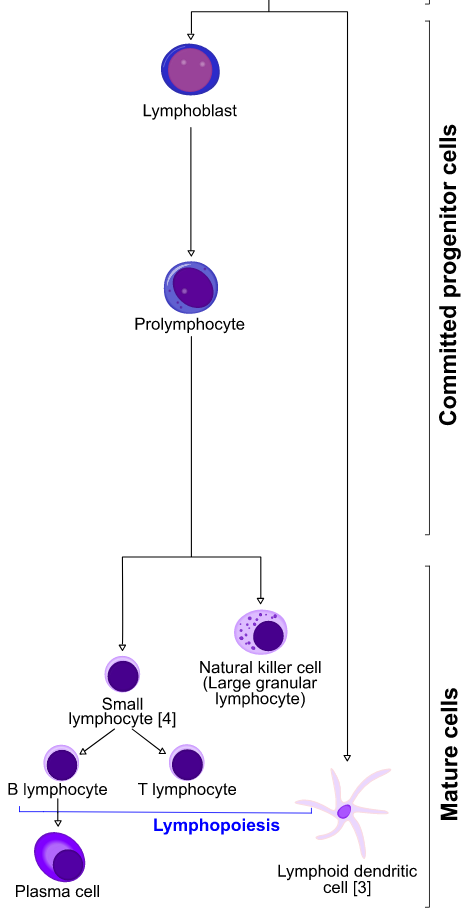
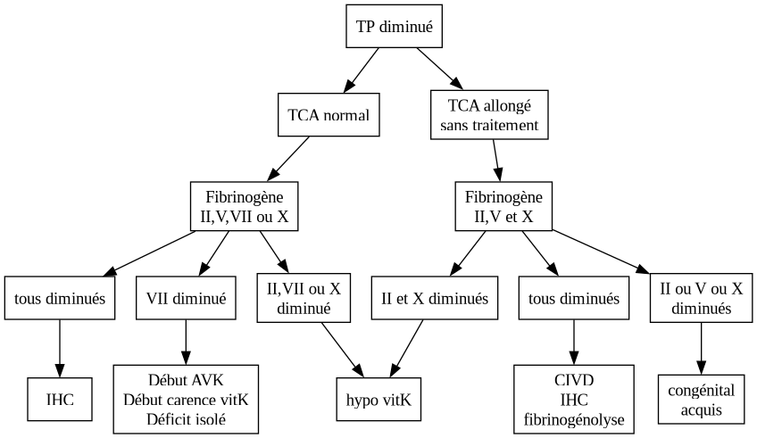
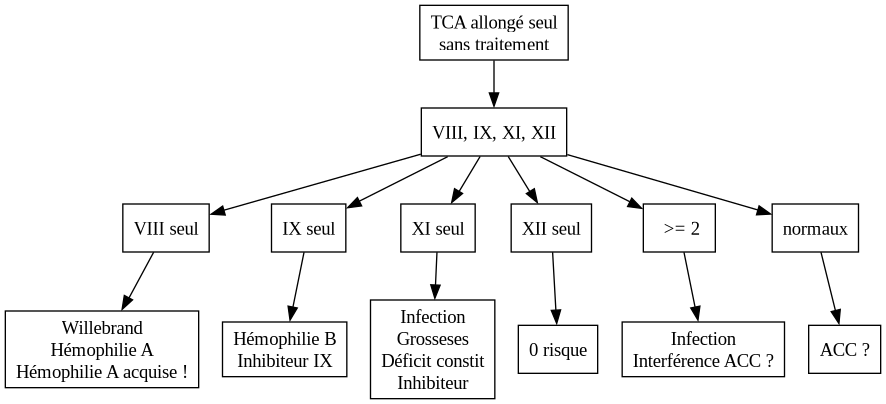

---
title: Hématologie
...

# Physiologie
-   Durée de vie
    -   GR: 120 jours
    -   plaquette 7 jours
    -   polynucléaire 24h
-   Localisation : sac vitellin (\<= 2 mois), foie/rate (\<= 7 mois)
    puis moelle

NB: dans la moelle, mégacaryocyte (normalement non présent dans moelle)

Moelle : progéniteur (non identifiable) -\> précurseurs (identifiable).
Puis cellules différenciées dans le sang

CSH

-   CD34+, CD38-
-   -\> progéniteur lymphoide ou myéloide
    -   différentiation restreinte à 1 ou 2 lignées
    -   CD34~~, CD38~~
-   peuvent reconstituer toute l\'hématoiès à long terme !
-   multipotente, autorenouvellement
-   nombreuses interactions CSH avec micro-environnement (\"niche\"
    hématopoïètique)

Pour lignée lymphocytaire:

-   le thymus sert à la différenciation des précurseurs des lymphocytes
    **T**
-   la moelle sert à la différenciation des précurseurs des lymphocytes
    B
-   les lymphocytes B matures, après activationo avec antigène, se
    différencien en LB mémoire et en plasmocytes qui produisent les
    anticorps circulants.

# Hémostase
-   Facteurs dépendant vitamine K: II, VII, IX, X
-   déficit en fibrinogène : le plus souvent acquis mais congénital
    possible
## Variation TP, TCA
Diminution TP

Augmentation isolée TCA sans traitement

Variations physiologiques

-   Grossesse :
    -   augmentation facteur VIII, Willebrand **fibrinogène**,
        diminution XI
    -   augmentation TP (VII, X, fibrinogène)
-   Nouveau-né : carence en vitamine K (donc doser TP, TCA)

## Facteurs

-   VIII: 50-150%, évolue parallèlement au willebrand (augmenté
    grossesse/inflammation mais aussi cirrhose hépatique par synthèse
    endothéliale)
-   IX : 50-150% : diminué avant 3 mois
-   XI: 60-140% : diminué avec 1 ans, diminué si IHC

## D-dimère

Produit de dégradation de la fibrine

-   augmenté si CIVD
-   bonne VPN pour thrombose/embolie pulmonaire (\<450-550)

## Principaux réactifs

### TP

-   TQ = II,V,VII,X et fibrinogène
-   insensible héparine dose thérapeutique et fibrinogène \> 0.6 ou \< 6
-   temps de coagulation d\'un plasma citraté avec facteur tissulaire +
    phospholipides en excès + calcium
-   conversion en % avec droite de Thivolle -\> TP
-   TP : spécifique seulement pour VII
-   Réactif := thromboplastine
    -   phospholipides
    -   facteur tissulaire
    -   calcium
    -   inhibiteur héparine
-   forte concentration en phospholipides donc TP peu sensible aux lupes
    anticoagulants
-   modifié par debigatran et rivaroxaban surtout (moins apixaban)

### TCA

-   TCA : mesure temps malade / temps témoin (ref \< 1.2)
-   Calcul temps témoins à chaque changement de lot, validation de
    réactif sur 30 sujets sains
-   Réactif : céphaline : phospholipides + activateur (kaolin)
-   Allongement variable par HNF en curatif variable
-   Choisir le réactif selon indication :
    -   dépistage risque hémorragique en pré-op
    -   dépistage lupus anticoagulant
-   Peu sensible au antiXa, sensible anti IIa

Dosage fibrinogène avec thrombine calcique en excès + inhibiteur
héparine : mesure du temps et conversion en g/L avec droite
d\'étalonnage

## Fibrinolyse
- Dégradation de la fibrine (une fois le caillot stabilisé)
- Fibrinogène -> (thrombine) monomère de fibrine -> (facteur XIIIa) fibrine insoluble -> (plasmine) D-dimère, produit dégradation fibrine
### Spécificité
Plasminogène
- Activé par t-PA (tissular Plasminogen Activator) et u-PA (urokinase, non fibrinospécifique)
  - t-PA : exercice, stress, stase veineuse. Soit lié à la fibrine, soit complexe avec PAI(Plasminogen activator inhibitor type)-1 et éliminé par le foie
- u-PA : protéolyse tissulaire surtout -> dégradation de la matrice extra-cellulaire, activation cytokines...
- Digestion de la fibrine par liaison plasminogène et t-PA (plasmine) [NB: l'acide tranexamique inhibe l'intercaction du plasminogène]
### Régulation
- \alpha_2 antiplaslmine : inhibe plasmine libre donc un déficit = hémorragie grave
- PAI-1 : inhibe t-PA et u-PA (thérapeutique : modification du t-PA recombinant pour le rendre moins sensibleau PAI-1)
- TAFI (Thrombin activatable fibrinolysis inhibitor) = inhibe liason plasminogène-fibrine
- fibrine elle-même (rend la réaction spécifique)
-  architecture de la fibrine (plus ou moins résistante à la fibrinolyse)
### Pahtologies
- hyperfibrinolyse = risque hémorragique : 
  - plasmine libre en circulation (déficit alpha2 antiplamsione, chirurgie, déficit PAI1, certaines leucémines aigües)
- hypofibrinolyse = risque de thrombose : déficit plasminogène, augmentation PAI1
### Exploration
- Global : thromboélastrogramme
- D-dimères, protéines fibrinolyse
- Si syndrome hémorragique (chir, post-partum), syndrome de consommation, exclure TVP/EP, thrombose récidivante
# Fonctionnement des automates d'hémostase

- Méthode : chronométrique (coagulante), enzymatiques (chromogénique), immuno
- Automates : Stago : starmaxo, Sysmex/Siemes: CS

## Techniques en hémostase
### Chromonétrique
- Ex: TP,TCA, facteur coagulation
- Principe : plasma pauvre en plaquettes : + phopsholipides, activateur +Ca2+ avec déclenchement de la coagulation à 37° -> chronomètre el temps de formation du caillot de fibrine
### Electromécanique (viscosimétrie)
-  Technique : oscillation d'une bille (champ électromagnétique). Avec la formation de la fibrine, augmentation de la viscosité et ralentissement du mouvement de la bille
- Avantages : pas d'interférence optique
- Inconvénient : moyenne d'amplitude trop faible

### Photo-optique
- Technique : détection signal diffracté (néphélémétrie) ou transmis (turbidimétrie) modifié par le caillot
- Avantages : voir la formation du caillot
- Inconvénients : détecte mal les petits caillots transparents, interférence si lipémie, hémolyse, hyperbilirubinémie -> lecture à 671nm pour minimiser c ou à plusieurs longueurs d'onde
- CS5100 : TP,TCA, fibrinogène
### Enzymatique : Chromogénique
- Mesure activité protéolytiques des : facteurs/inhibiteurs coag/acttivité AOD ou hépariné
- Principe : susbtrat chromogène + oligopetite spécifique enzyme à doser (qui va couper le petite et libérer le substrat chromogène) -> intensité dus signal proportionnel à l'activité
- Avantages : très spécfiques, mesure activité
- Inconvénients : interférence lipémie, hémolyse hyperbilirubinémie, réactifs couteux
- CS5100 antithrombine, protéine C
### Immuno à détection photo-optique (immunoturbidimétrie)
- Dosage quantitatif Ddimères, monomèes de fibrine, facteur/inhib coag
- Réaction Ag-Ac
- Avantages : très sensible et spécfiique
- Inconvénient : réactif couteux, nb tests disponibles limités
- CS5100 : D-dimères

## Examens de biologie médical délocalisés 
- Resoponsable = laboratoire
- hHémosatse : attention préanalytique et analytique
- Activated clotting time = chir cardique, radiologie interventionnelle -> surveillance anticoagulation par héparine (chronométrique, sans total)
- TP/INR : INR bien validé surveillance AVK, TP moins validé (guide transfusioin, dépistage coaguliopathies)
- Fonction plaquettaire après ttt anti plaquettaire : résistance, hémorragie -> pas de recommandation, recherche
- Verify now=  mesure agrégation par turbidimétrie optique
- Fonction plaquettaire par impédiance
- Thromboélastographie : ROTM et TEG
  - étude viscosité et élasticité du sang pendant coag -> calcul temps initiation coagulation, vitesse formation caillot, stabilité (fibrinolyse)
  - péri-opératoire (trauma sév-ère, hémorragie post-partum...)
# Maladies

## Myélome

-   prolifération plasmocytaire maligne avec soit une Ig entier soit une
    chaîne légère libre
-   Rare chez sujet jeune (âge médian 70ans)
-   Conséquences de la prolifération tumorale
    -   activation ostéoclastes -\> hypercalcémie, fragilisation os
    -   suppression hématopoièse normale (GR)
    -   déficit immunitaire humorale (hypogammaglobulinémie car
        plamocytes normaux sont inhibé par clone)
    -   rénal: accumulation de chaînes légères libres/Ig entière
        (néphropathies à cyclindre), hypercalcémie...
-   prolifération: B puis moelle (MGUS -\> myélome) puis sang (leucémie
    aigüe à plasmocytes)
-   formes biologiques :
    -   Ig monoclonaire entières (surtout IgG) 80-85%
    -   chaîne légère libre isolée
    -   non sécrétant
-   autres: plasmocytome solitairee, leucémie à plasmocytes (pronostic
    sombre)

### Diagnostic (2014)

-   {plasmocytes médullaires \> 10% ou plasmocytome extramédulaire} et 1
    parmi
    -   signes CRAB (hyperCacémie, insuffisance Rénale, Anémie, Bone)
    -   nouveau marqueur
        -   plasmocytose médullaire clonale \>= 60%
        -   chaine légres impliquée/non impliqué \>= 100
        -   \> 1 lésion focale IRM

    NB:
    -   myélome indolent : pas de CRAB, pas de nouveau marqueur et
        {IgG/IgA \>= 30 ou dans les urines \>= 500mg/24hou plasmocytose
        médullaire entre 10 et 60%}
    -   MGUS : tout négatif (pas de CRAB, pas de marqeur, Ig \< 30,
        médullaire \< 10%)

### Pronostic et traitement

-   myélome multiple = incurable
-   score ISS
-   réponse au traitement : disparation monoclonale, plasmocytaire
    monoclonaires
-   surveillance : EPS +/- dosage chaine légère

### Bilan initial

-   EPS (pic β, γ ou α; ou hypogamma isolée \[suspicion chaine légre
    monoclonale\]
-   immunofixation
-   chaînes légres libres κ et λ sérum
-   uraines 24h: EPS et immunofixation: chaîne lére monoclonaire
    (protéinuire Bence-Jones)
-   hémogramme (hémoaties en rouleau \[hyperprotidémie\], anémie
    normochromoe, normocytaire, arégénératives)
-   myélogramme

## Polyglobulie de Vaquez

Diagnostic : A1 + A2 + {A3 ou B}

A1 : Hb \> 16.5 (16 femmes) ou Hct \> 0.49 (0.48) ou masse globulaire
totale \> 125% A2 : biopsie méudllaire : hypercellularité, panmyélose,
mégacaryocytes mature pléiomorphe A3: mutation JAK2 (V617F) B :
diminution EPO

NB: on peut éviter la biopsie osseuse si Hb \> 18.5 avec JAK2 et EPO
mais elle permet de voir une fibrose initiale (permet de dépister
myelofibrose)

Risque :

-   vasculaire (court terme) : thromobse art/vein, hémorragie (!)
-   hémato (long terme) : myélofibrose, myélodysplasie, leucémie aigue

Traitement :

1.  aspirine/saignée
2.  si haut risque : hydroxyurée ou ropeginterferon
