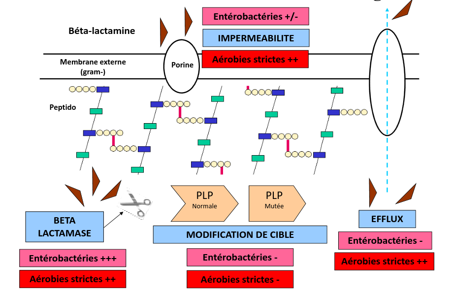
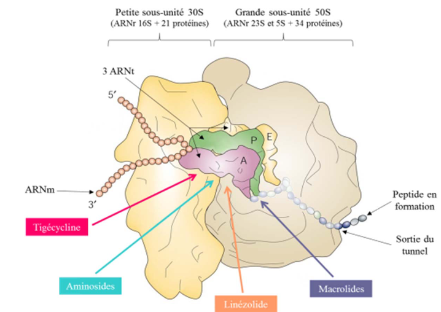

#bacterio
## Cibles

-   inhibition synthèse de la paroi bactérienne = β-lactamine,
    glycopeptides, fosfomycine
-   synthèse ADN bactérien : quinolone, sulfamide
-   synthène ARN : rifampicine
-   synthèse protéines bactérienne : aminoside, macrolides, cyclines

## Mécanisme de résistance

-   enzymatique
-   modification de la cible
-   impermeabilité
-   efflux

 Résistance
naturelle

-   colistine: bactérie gram+
-   vancomycine : bactérie gram -
-   aminoside: anaérobie

### Synthèse paroi

1.  β-lactamase

    -   Les β-lactamine inhibent la synthèse de la paroi bactérienne
        (peptidoglycane)
        -   se fixent sur les PLP (protéine de liaison des pénicillines)
        -   mécanisme de compétition
    -   toutes les β-lactamines ont un cycle commun (β-lactame)
    -   les β-lactamase vont hydrolyse ce cycle et désactiver les
        β-lactamines

2.  Modification de cible : PLP

    -   S. aureus : mutation dans le gène mecA : la PLP mutée (=PLP2a)
        ne permet plus aux β-lactamine de s\'y fixer
    -   Idem pour les PLP mosaïques des pneumocoque
    -   Idem pour les entérocoque (PLP5)

### Synthèse protéine bactérienne

-   aminoside: mauvaise reconnaissance de l\'ARN messager (modification
    de la cible)
-   linezolide : mauvaise position de l\'ARNt (apporte les acides
    aminés) (modification de la cible)
-   macrolides : bloque la formation du peptide (\"tunnel\") (enzyme)

### Synthèse acide nucléique

-   ADN gyrase va \"détordre\" la double hélice pour la transcription et
    traduction
-   quinolones vont empêcher cette action (modification de la cible)

## Notes

-   β-lactamine inefficaces sur les mycoplasme car pas de paroi !
-   glycopeptides inefficaces sur bactérie Gram négatif car elles ont
    une membrane externe qui ne laisse pas passer les grosses molécules
-   synergie β-lactamine - aminoside sur strepto et entérocoque :
    destruction de la paroi par les β-lactamine pour que l\'aminoside
    accède au ribosome
-   seules les antibio pénétrant dans les cellules (macrolides,
    fluoroquinolones, rifampicine, cycline ) sont actives contre les
    bactéries \"intracellulaires \" (Chlamydia, Coxiella burnetti,
    Rickettsia, Legionella pneumophilia, Brucella meltiensi, Bartonella
    )

## Résumé

|                     |Péni G/V                    |Péni A                                      |Peni A + inhib βlactamase        |Peni M
| --------------------|----------------------------|--------------------------------------------|---------------------------------|---------------------
| Utile               |Streptocoque                |idem + pneumocoque péniS                    |idem + Staphylocoque metiS       |Staphylocoque metiS
|                     |Corynebacterium             |E. faecalis, Listeria monocytogenes         |H. influenza + pénicillinase     |
|                     |Diphteria                   |Neisseria menigitidis                       |Enterobactéries + pénicillinase  |
|                     |                            |Entérobactéries groupe 1                    |BNG anaérobies                   |
| Résistance nat      |BGN                         |Entérobactéries groupe 2, 3; P. aeruginosa  |                                 |BGN
| Résistance acquise  |Staphylocoque, pneumocoque  |Staphylocoque +/- pneumocoque               |                                 |Staphylocoque metiR
|                     |                            |H. influenza, N. gonorrhea                  |                                 |
|                     |                            |N. mengitidis                               |                                 |

PéniM = oxacilline, cloxacilline PéniA = amox

|             |C2G                               |C3G orale (1)       |C3G injectable
|-------------|----------------------------------|--------------------|---------------------------------
| Utile       |Streptocoque, Staphylocoque metS  |Streptocoque        |Streptocoque (dont pneumocoque)
|             |Entérobactérie groupe 1           |entérobactérie 1,2  |Neisseria spp, entérobactérie
|             |                                  |                    |Haemophilus
| Résistance  |Listeria, entérocoque             |idem                |idem
|             |Staphylocoque metiR               |                    |
|             |P. aeruginosa, intracellaire      |                    |

\(1\) limité car mauvais biodisponibilité

|                       |Carbapénème                               |FQ                         |Aminoside (2)
| ----------------------|------------------------------------------|---------------------------|--------------------------------------
| Utile                 |Entérobactérie, P. aeruginosa             |Entérobactérie             |Staphylocoque metiS
|                       |Entérocoque, Staphylocoque metiS          |Intracellulaire            |Listeria monocytogenes
|                       |Anaérobie                                 |Staphylocoque metiS        |BGN
|                       |                                          |P. aeruginosa : ciproflox  |Streptocoque, pneumocoque
| Résistance naturelle  |P. aeruginosa, entérocoque: ertapénème !  |entérocoque, L. monocyt    |strepto, pneumo: **bithérapie amox**
|                       |                                          |anaérobie                  |anaérobie stricte
| Résistance acquise    |carbapénémase                             |SAMR, gonocoque (1)        |
                                                                                                

\(1\) Pas de monothérpaie pour P. aeruginosa et Staphylocoque aureus
(risque mutants) (2) amikacine, gentamicine

|                     |Macrolides (1)                 |Lincosamide (2)   |Métronidazole                            |Glycopeptide (3)
|---------------------|-------------------------------|------------------|-----------------------------------------|----------------------------
|Utile                |Intracellulaire, streptocoque  |Strepocoque       |Anaérobie (sauf Acineto, cutibacterium)  |Streptocoque, pneumocoque
|                     |Staphylocoque metiS            |Staphylocoque     |Parasite                                 |Entérocoque, staphylocoque
|                     |                               |                  |                                         |metiS/metiR
|                     |                               |                  |                                         |Clostri
|Résistace naturelle  |entérobactérie, P. aeruginosa  |BGN, E. faecalis  |Autres                                   |BGN
|résistance acquise   |staph, pneumocoque, strepo A   |staph, strepto    |                                          

\(1\) erythro, azithromycine, clarithromycine (2) clindamycine (3)
vancomycine

## Interprétation

Entérobactéries

-   Groupe 1: TRI = résistance amox/ticar/pipe + inhibiteur β-lactamase
-   **Céphalosporinase** = **inhibée oxacilline**
-   **BLSE** = inhibée par acide clavulanique =\> **\"bouchon de
    champagne\"**
    -   synergie C3G/C4G - ticar + acide clavulanique
    -   ne touche pas les carbapénèmes
    -   cefoxitine non touchée =\> permet de différencer d\'une
        céphalosporinase déréprimée (voir tableau)

|               |Pénicillinase  |Pénicillinase déréprimée  |Céphalo sporinase  |Céphalo. déréprimée  |BLSE       |Carba pénémase
|---------------|---------------|--------------------------|------------------|---------------------|-----------|----------------
|amoxicilline   |R              |R                         |R                 |R                    |R          |R
|ticarcilline   |R              |R                         |                  |R                    |R          |R
|piperacilline  |I/R            |R                         |                  |R                    |R          |R
|amox+inhib β   |               |I/R                       |R                 |R                    |**S/I/R**  |R
|pipe/ticar     |               |I/R                       |                  |I/R                  |**S/I/R**  |R
|\+ inhib β     |               |                          |                  |                     |           |
|C1G            |               |I/R                       |R                 |I/R                  |R          |R
|C2G            |               |                          |I/R               |I/R                  |           |I/R
|C3G            |               |                          |I/R               |I/R                  |I/R        |S (OXA-48)/I/R
|C4G            |               |                          |                  |                     |I/R        |S (OXA-48)/I/R
|carbapénème    |               |                          |                  |                     |           |I/R

- AMX = amoxicilline
- TIC = ticarcilline
- PIP = piperacilline
- AMC = amox - acide clavulanique 
- C1G = céfalotine (CF)
- C2G = céfoxitine (FOX)
- C3G = céfixime (CFM), céfotaxime (CTX), ceftazidime (CAZ)
- C4G = céfépime (FEP)

### MSLB

Résistance à l\'érythromicine

-   sensible pristinamycine : regarder si induction (\"interaction\"),
    si oui, MSLB inductible donc possible sélection de mutant.
-   résistant pristinamycine : MSLB constitutif

## Piège

-   SAUR sensible oxa mais résistance peni G =\> pénicillinase -\>
    résistance à toute les pénicillines
-   SARM = résistance à toutes les βlactamanes dont imipénème
-   Aminoside
    -   résistance gentamicine =\> forcément résistant tobramycine,
        amikacine, kanamycine
    -   résistance amikacine =\> forcément résistant kanamycine
-   FQ : résistance à ofloxacine =\> forcément toutes les quinolones

## Aminosides

Action = bactéricide, concentration dépendant. Perturbe la synthèse des
protéine (fixation sous unité 30s des ribosomes) Résistances

-   naturelle: anaérobie strictes et préférentielle (streptocoques,
    entérocoques) par défaut de pénnétration car le système de transport
    nécessite la force produite par les chaînes respiratoire aérobies
    *NB: penicilline + amoniside passe car agit sur la paroi
    bactérienne*

## Sulfamide

Bactériostatique (inhibe croissance) mais en synérgie devient
bactéricide Ex: sulfamethoxazole + trimethoprime (Bactrmie)

Mécanisme : inhibe synthèse microbionne d\'acide folique

## Fluoroquinolone

-   4 générations: initialement répartition extra-cellulaire -\> large
    et homogène (intracellulaire) avec les dernières générations
-   Élimination rénale et bile
-   Effets indésriable nombreux : digestif, phototoxique, trouble
    nerveur, inhibe cytochrme P450 (! interactions)
-   Contre-indication : déficit G6PI, grossesse
-   Action : inhibe réplication et transcription ADN
-   Bactéricide, concentration dépendantes
-   Indication :
    -   quinolones = cystite aigùe simple non compliquée, récidivantes
        chez l\'adulte

    -   2e génération : infetions sévères à bacille Gram négatif

    -   3e et 4e génération : sinusite aigüe bactériennes, exacerpbation
        pneumopathie communutaire, infection compliquée peau + tissus
        mous

        Résistante : en augmentatino chez entérobactéries (E. coli,
        Klebsiella)

## Métronidazole

Pour anaérobie strictes

## Infection ostéo-articulaires
-   Rifampicine, quinolone pour diffusion
-   dapto : activité antibiofilm
