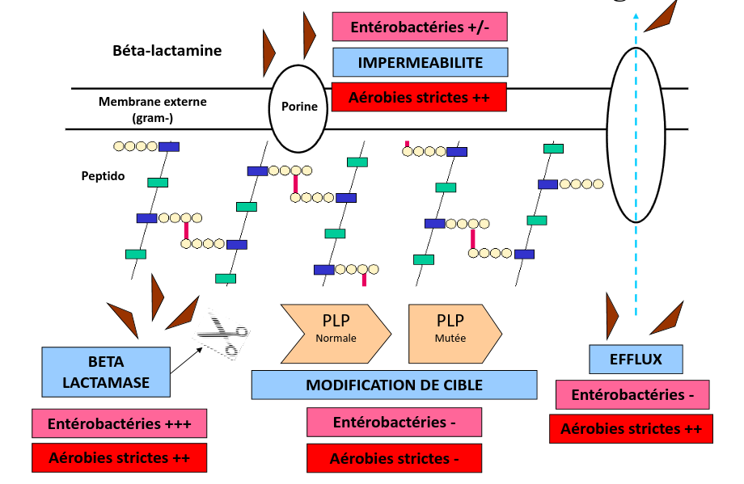
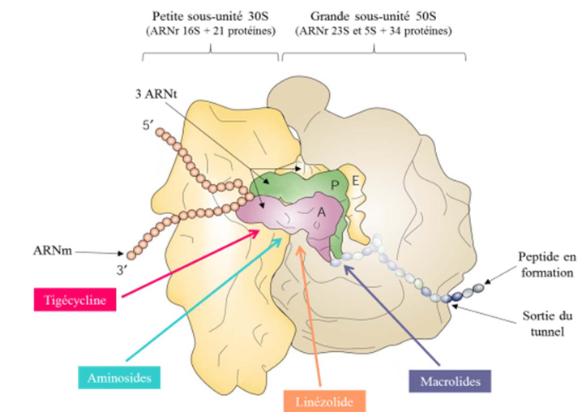
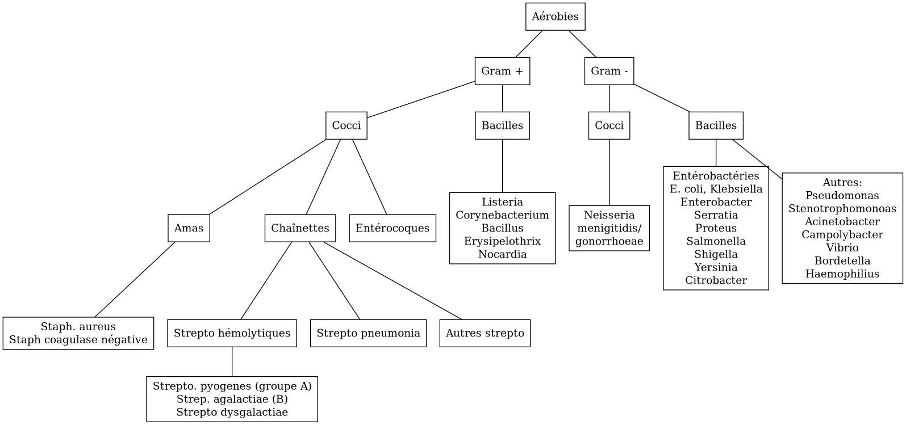
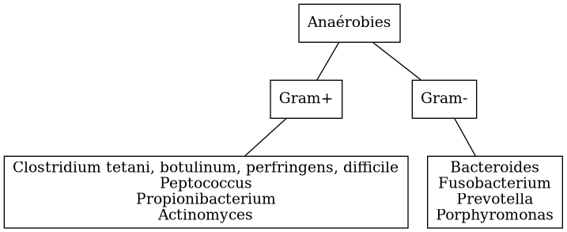
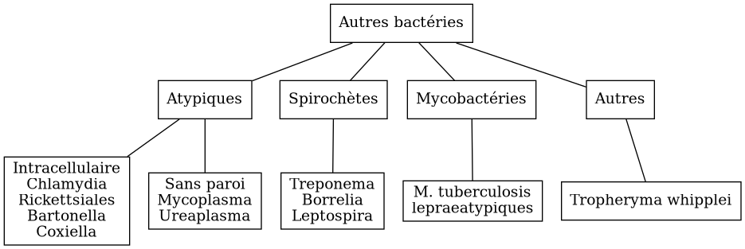

+++
title = "Bactériologie"
date = 2023-06-01
+++

# Antibiotiques

## Cibles

-   inhibition synthèse de la paroi bactérienne = β-lactamine,
    glycopeptides, fosfomycine
-   synthèse ADN bactérien : quinolone, sulfamide
-   synthène ARN : rifampicine
-   synthèse protéines bactérienne : aminoside, macrolides, cyclines

## Mécanisme de résistance

-   enzymatique
-   modification de la cible
-   impermeabilité
-   efflux

 Résistance
naturelle

-   colistine: bactérie gram+
-   vancomycine : bactérie gram -
-   aminoside: anaérobie

### Synthèse paroi

1.  β-lactamase

    -   Les β-lactamine inhibent la synthèse de la paroi bactérienne
        (peptidoglycane)
        -   se fixent sur les PLP (protéine de liaison des pénicillines)
        -   mécanisme de compétition
    -   toutes les β-lactamines ont un cycle commun (β-lactame)
    -   les β-lactamase vont hydrolyse ce cycle et désactiver les
        β-lactamines

2.  Modification de cible : PLP

    -   S. aureus : mutation dans le gène mecA : la PLP mutée (=PLP2a)
        ne permet plus aux β-lactamine de s\'y fixer
    -   Idem pour les PLP mosaïques des pneumocoque
    -   Idem pour les entérocoque (PLP5)

### Synthèse protéine bactérienne

-   aminoside: mauvaise reconnaissance de l\'ARN messager (modification
    de la cible)
-   linezolide : mauvaise position de l\'ARNt (apporte les acides
    aminés) (modification de la cible)
-   macrolides : bloque la formation du peptide (\"tunnel\") (enzyme)

### Synthèse acide nucléique

-   ADN gyrase va \"détordre\" la double hélice pour la transcription et
    traduction
-   quinolones vont empêcher cette action (modification de la cible)

## Notes

-   β-lactamine inefficaces sur les mycoplasme car pas de paroi !
-   glycopeptides inefficaces sur bactérie Gram négatif car elles ont
    une membrane externe qui ne laisse pas passer les grosses molécules
-   synergie β-lactamine - aminoside sur strepto et entérocoque :
    destruction de la paroi par les β-lactamine pour que l\'aminoside
    accède au ribosome
-   seules les antibio pénétrant dans les cellules (macrolides,
    fluoroquinolones, rifampicine, cycline ) sont actives contre les
    bactéries \"intracellulaires \" (Chlamydia, Coxiella burnetti,
    Rickettsia, Legionella pneumophilia, Brucella meltiensi, Bartonella
    )

## Résumé

|                     |Péni G/V                    |Péni A                                      |Peni A + inhib βlactamase        |Peni M
| --------------------|----------------------------|--------------------------------------------|---------------------------------|---------------------
| Utile               |Streptocoque                |idem + pneumocoque péniS                    |idem + Staphylocoque metiS       |Staphylocoque metiS
|                     |Corynebacterium             |E. faecalis, Listeria monocytogenes         |H. influenza + pénicillinase     |
|                     |Diphteria                   |Neisseria menigitidis                       |Enterobactéries + pénicillinase  |
|                     |                            |Entérobactéries groupe 1                    |BNG anaérobies                   |
| Résistance nat      |BGN                         |Entérobactéries groupe 2, 3; P. aeruginosa  |                                 |BGN
| Résistance acquise  |Staphylocoque, pneumocoque  |Staphylocoque +/- pneumocoque               |                                 |Staphylocoque metiR
|                     |                            |H. influenza, N. gonorrhea                  |                                 |
|                     |                            |N. mengitidis                               |                                 |

PéniM = oxacilline, cloxacilline PéniA = amox

|             |C2G                               |C3G orale (1)       |C3G injectable
|-------------|----------------------------------|--------------------|---------------------------------
| Utile       |Streptocoque, Staphylocoque metS  |Streptocoque        |Streptocoque (dont pneumocoque)
|             |Entérobactérie groupe 1           |entérobactérie 1,2  |Neisseria spp, entérobactérie
|             |                                  |                    |Haemophilus
| Résistance  |Listeria, entérocoque             |idem                |idem
|             |Staphylocoque metiR               |                    |
|             |P. aeruginosa, intracellaire      |                    |

\(1\) limité car mauvais biodisponibilité

|                       |Carbapénème                               |FQ                         |Aminoside (2)
| ----------------------|------------------------------------------|---------------------------|--------------------------------------
| Utile                 |Entérobactérie, P. aeruginosa             |Entérobactérie             |Staphylocoque metiS
|                       |Entérocoque, Staphylocoque metiS          |Intracellulaire            |Listeria monocytogenes
|                       |Anaérobie                                 |Staphylocoque metiS        |BGN
|                       |                                          |P. aeruginosa : ciproflox  |Streptocoque, pneumocoque
| Résistance naturelle  |P. aeruginosa, entérocoque: ertapénème !  |entérocoque, L. monocyt    |strepto, pneumo: **bithérapie amox**
|                       |                                          |anaérobie                  |anaérobie stricte
| Résistance acquise    |carbapénémase                             |SAMR, gonocoque (1)        |
                                                                                                

\(1\) Pas de monothérpaie pour P. aeruginosa et Staphylocoque aureus
(risque mutants) (2) amikacine, gentamicine

|                     |Macrolides (1)                 |Lincosamide (2)   |Métronidazole                            |Glycopeptide (3)
|---------------------|-------------------------------|------------------|-----------------------------------------|----------------------------
|Utile                |Intracellulaire, streptocoque  |Strepocoque       |Anaérobie (sauf Acineto, cutibacterium)  |Streptocoque, pneumocoque
|                     |Staphylocoque metiS            |Staphylocoque     |Parasite                                 |Entérocoque, staphylocoque
|                     |                               |                  |                                         |metiS/metiR
|                     |                               |                  |                                         |Clostri
|Résistace naturelle  |entérobactérie, P. aeruginosa  |BGN, E. faecalis  |Autres                                   |BGN
|résistance acquise   |staph, pneumocoque, strepo A   |staph, strepto    |                                          

\(1\) erythro, azithromycine, clarithromycine (2) clindamycine (3)
vancomycine

## Interprétation

Entérobactéries

-   Groupe 1: TRI = résistance amox/ticar/pipe + inhibiteur β-lactamase
-   **Céphalosporinase** = **inhibée oxacilline**
-   **BLSE** = inhibée par acide clavulanique =\> **\"bouchon de
    champagne\"**
    -   synergie C3G/C4G - ticar + acide clavulanique
    -   ne touche pas les carbapénèmes
    -   cefoxitine non touchée =\> permet de différencer d\'une
        céphalosporinase déréprimée (voir tableau)

|               |Pénicillinase  |Pénicillinase déréprimée  |Céphalo sporinase  |Céphalo. déréprimée  |BLSE       |Carba pénémase
|---------------|---------------|--------------------------|------------------|---------------------|-----------|----------------
|amoxicilline   |R              |R                         |R                 |R                    |R          |R
|ticarcilline   |R              |R                         |                  |R                    |R          |R
|piperacilline  |I/R            |R                         |                  |R                    |R          |R
|amox+inhib β   |               |I/R                       |R                 |R                    |**S/I/R**  |R
|pipe/ticar     |               |I/R                       |                  |I/R                  |**S/I/R**  |R
|\+ inhib β     |               |                          |                  |                     |           |
|C1G            |               |I/R                       |R                 |I/R                  |R          |R
|C2G            |               |                          |I/R               |I/R                  |           |I/R
|C3G            |               |                          |I/R               |I/R                  |I/R        |S (OXA-48)/I/R
|C4G            |               |                          |                  |                     |I/R        |S (OXA-48)/I/R
|carbapénème    |               |                          |                  |                     |           |I/R

- AMX = amoxicilline
- TIC = ticarcilline
- PIP = piperacilline
- AMC = amox - acide clavulanique 
- C1G = céfalotine (CF)
- C2G = céfoxitine (FOX)
- C3G = céfixime (CFM), céfotaxime (CTX), ceftazidime (CAZ)
- C4G = céfépime (FEP)

### MSLB

Résistance à l\'érythromicine

-   sensible pristinamycine : regarder si induction (\"interaction\"),
    si oui, MSLB inductible donc possible sélection de mutant.
-   résistant pristinamycine : MSLB constitutif

## Piège

-   SAUR sensible oxa mais résistance peni G =\> pénicillinase -\>
    résistance à toute les pénicillines
-   SARM = résistance à toutes les βlactamanes dont imipénème
-   Aminoside
    -   résistance gentamicine =\> forcément résistant tobramycine,
        amikacine, kanamycine
    -   résistance amikacine =\> forcément résistant kanamycine
-   FQ : résistance à ofloxacine =\> forcément toutes les quinolones

## Aminosides

Action = bactéricide, concentration dépendant. Perturbe la synthèse des
protéine (fixation sous unité 30s des ribosomes) Résistances

-   naturelle: anaérobie strictes et préférentielle (streptocoques,
    entérocoques) par défaut de pénnétration car le système de transport
    nécessite la force produite par les chaînes respiratoire aérobies
    *NB: penicilline + amoniside passe car agit sur la paroi
    bactérienne*

## Sulfamide

Bactériostatique (inhibe croissance) mais en synérgie devient
bactéricide Ex: sulfamethoxazole + trimethoprime (Bactrmie)

Mécanisme : inhibe synthèse microbionne d\'acide folique

## Fluoroquinolone

-   4 générations: initialement répartition extra-cellulaire -\> large
    et homogène (intracellulaire) avec les dernières générations
-   Élimination rénale et bile
-   Effets indésriable nombreux : digestif, phototoxique, trouble
    nerveur, inhibe cytochrme P450 (! interactions)
-   Contre-indication : déficit G6PI, grossesse
-   Action : inhibe réplication et transcription ADN
-   Bactéricide, concentration dépendantes
-   Indication :
    -   quinolones = cystite aigùe simple non compliquée, récidivantes
        chez l\'adulte

    -   2e génération : infetions sévères à bacille Gram négatif

    -   3e et 4e génération : sinusite aigüe bactériennes, exacerpbation
        pneumopathie communutaire, infection compliquée peau + tissus
        mous

        Résistante : en augmentatino chez entérobactéries (E. coli,
        Klebsiella)

## Métronidazole

Pour anaérobie strictes

# Bactéries

## Staphylocoques

### Résistances

-   β-lactamine : production pénicillinase (BlaZ)\> 90%
-   résistance méticilline (staph coag négative \>\> aureus) via
    -   la Staphylococcal Cassette Chromosome mec (SCCmec) \[= zone
        génomique comprenant *mecA* qui code pour la protéine PLP2a
    -   Nouveau gène mecC: code PLP2c
    -   S. aureus : 15-20% résistant méticilline
-   Macrolides-Lincosamide-Streptogramine-Kétolide (MLSK) : modification
    de la cible surtout (modification/mutation ribosome)
    -   phénotype MLS~B~: inductible ou constitutionnel
-   3 phénotype de résistance aux aminosides (inactivation enzymatique =
    5% SAMS mais 80-90% SARM)
-   glycopeptide : exceptionnel

### Staphylococcus aureus

Cocci Gram+ en amas : aérobie +/- anaérobie. Immobiles. non capsulé, non
sporulé

1.  Facteurs de virulence

    Associé à la paroi:

    -   **coagulase** liée = récepteur au fibrinogène, sur la paroi
        bactérienne -\> diag (test d\'agglutination)
    -   protéine A: liaison aux immunoglobuline, protection contre la
        phagolytose

    Excrété

    -   hémolysine : lyse des hématies (β-complète)
    -   coagulase libre = excrétée, clive le fibrinogène -\> embole
        septiques. Différence avec les staph. à coagulase négative (S.
        epidermidis)
    -   staphylokinase : libère bactéries des emboles
    -   **toxine** :
        -   leucocidine de Panton et Valentine (LPV) -\> leucotoxique
            dermonécrotique
        -   toxine du choc staphylococcique (TSST1-1 -\> activation
            lymphocytes T)
        -   exfoliatines -\> érythrodermie bulleuses
        -   entérotoxines thermostables -\> TIAC

2.  Habitat

    -   30% porteur sain (transitoire ou non)
    -   Transmission intra-humaine par les mains ou indirectevement
        (vêtements+++)
    -   Commensal : microbiote nasal, oropharyngé, digestif, cutané
        (aisselles)

3.  Clinique

    -   Porte d\'entrée = cutanée \<-\> site de portage/infection
    -   Infection communautaires, associées aux soins
    -   Infection toxiniques :
        -   LPV : infection cutanée, pneumonie nécrosante
        -   TSST1 = choc toxinique avec érythrodermie. Entrée = vaginale
            ou cutanée
        -   exfoliatine: impétigo bulleux, syndrome d\'exfoliation
            généralisée
        -   entérotoxine = diarrée à +2h ou 4h, TIAC
    -   Infections suppurative
        -   cutanée superficielle (furoncle, impétigo, folliculite) ou
            profondre (abcèse, fasciite)
        -   bactériémie, endocardite
        -   infections profondes : ostéo-articulaire, pneumopathie,
            neuroméningées (abcès)

4.  Diagnostic

    -   Culture : non exigeante
        -   gélose sang 24h: **beta-hemolytique** (hémolyse total)
        -   Chapman (mannitol + NaCl) : rouge -\> jaune avec NaCl
        -   catalase +, oxydase-, DNAse + (à la différece des tretop à
            coagulase négative)

5.  Sensibilité et résistance

    Résistance fréquent à l'hôpital

    -   β-lactamines :
        -   phénotype sauvage sensible
        -   pénicilinase \> 90% des souches (disque FOX de pénicilline
            g): résistance pénicilline G, V, A -\> ajout d'inhibiteur de
            β-lactamase
        -   SARM = gène mecA : PLP2 additionnelle -\> résistance à
            toutes les β-lactamines **et imipénème**. Souvent
            multirésistance aminoside, macrolide, fluoroquinolonie
            -   vancomycine en 1ere intention
            -   C4G possible mais pas en france
    -   Aminoside : sauvage sensible, résistance acquise par
        inactivation enzymatique
    -   Glycopeptide : sauvage sensible, phénotype gIA/hétéroGISA avec
        sensibilité diminusée, phénotype gRSA (résistance)

6.  Traitement habituellement actifs

    oxacilline, gentamicine (aminoside), vancomycine (glycopeptide)

### Staphylococcus non aureus

-   = coagulase négative
-   opportuniste, favorisé par immunodépression, cathé
-   S. epidermidis = le plus souvent à l\'hôpital : matériel (prothèse,
    valve dérivation)
-   S. haemolytius
-   S. epidermidis, haemolyticus = fréquemment multirésistante
-   infections communautaire = S. saprophyticus (cystite) , S.
    ludgunensis (infections cutanées, endocardite infectieuses)
-   traitement : glycopeptide, rifampicine

1.  Staphylococcus saprophyticus

    -   Cocci gram + en amas, catalase positive, nitrate réductase
        négative
    -   Urine :rose sur milieu chromogène mais identification
        spectromètre de masse/biochimiue
    -   Sensibilité nature à la plupart des antibiotique anti-staph
    -   Résistance naturelle : fosfomycine, acide fusidique, novobiocine
    -   Résistance acquise fréquente : péni G, érythromycine

## Campylobacter

-   Répartition mondiale
-   Une des cause les plus fréquentes des diarrhées infectieuses
    bactériennes communautaires
-   Microbiote digestive de nombreux animaux : *jejuni* = oisaux, /coli=
    porc
-   transmission animale -\> homme par **alimentation** : surtout
    **jejuni**, **coli**, **fetus**
-   très mobile pour survivre dans le tube digestif

### Pouvoir pathogène

-   douleur abdo
-   **gastro-entérique aigue fébrile** : (diarrhées aqueuse voire
    mucosanglange, fièvre , vomissement)
-   bactériémie
-   syndrome de l\'intestin irritable
-   syndrome de Guillan-barré

### Diagnostic bactério

-   selles (copro): PCR, immunochromatographique
-   sang (hémoc)
    -   examen direct : en forme de S, non sporulé, en \"vol de
        moucheron\"
-   culture : sélectif en microaérobie
-   **oxydase+**, catalase souvent +
-   MALDI-TOF

### ATBgramme

-   résistance naturelle : vancomycine, pénicilline G, M,
    céphalosporine, triméthoprime, streptogramine B
-   acquise : érythro, tétracycline, quinolone, amox

### Traitement

-   déshydratation
-   si fièvre \> 38°, sang dans les selles, enfants, personnes agée,
    femmes enceintes: **azithromycine**
-   systémique : aminoside + {FQ ou beta-lactamine} sur documentation

### Prévention: hygiène (eau, alimentation)

## Proteus mirabilis

-   Bacille gram négatif, **mobile**, oxydase négatif, nitrate-réductase
    positive
-   Brun sur milieu chromogène, β-glucuronidase et β-glucosidase
    négative
-   Désaminase positive, indole négative
-   Sensible antibio actif sur bacille gram négatif
-   Résistance acquise : pénicillinase, BLSE, céphalosporinase de haut
    niveau, carbapénémase

##  Pseudomonas aeruginosa 

Bacille Gram négatif, très mobile

Origine : environnement++. saprophyte des milieux humides
**Opportuniste** : 10% des infections en hospitalisation

-   infection nosocomiale (matériel) ou . 1ere bactérie en réa
-   mucoviscidose: colonisation ou infection bronchopulmonaire chronique

Facteurs de virulence : exotoxine, exoprotéines, hémolysine Facteur
d\'adhésion Forte capacité à former des biofilms

### Quand réaliser un antibiogramme

-   suspicion responsable d\'infection
-   colonisation de patients fragile (ID, intbués)
-   pulmonaire isolé de patients muco, BPCO, DDB

### Diagnostic {#diagnostic-1}

-   Pousse 24h à 37% sur milieu non sélectif.
-   Milieu sélectif : cétrimide
-   Oxydase positif (!= entérobactéries) -\> test rapide pour
    différencier les 2

### Résistance

Naturellement plus résistante que d\'autres Bacille gram -

-   Catalase positif - lactose négatif

1.  Résistance naturelle :

    -   amox
    -   C1G, C2G, **céfotaxime** (*! utilisé pour mécanisme*),
        ceftriaxone, **ertapénème**
    -   anciennes FQ : nofloxacine, péflox, ofloxanie
    -   cotrimoxazole
    -   nitrofurantoine
    -   macrolides
    -   azithromycine

    Association de plusieurs mécanisme (synérgie/complémentaire)

    -   β-lactamase AmpC (large spectre, inductible)
    -   enzyme modificatrice aminoside
    -   effluxs actif (mexAB-OprM, MexXY/OprM)
    -   imperméabilité (porine OpriF)

2.  Résistance acquise

    -   Surproduction : efflux, β-lactamase AmpC, alétaration porine+++

    -   gène codant β-lactamase

    -   Attention: certaines souches accumulent des résultats

    -   β-lactamase transférable : pénicillinase, BLSE, carbapénémase

        Quand chercher BLSE ?

        -   synergie ceftazidime/cefepime et acide clavulanique
        -   synergie ceftazidime/cefepime et impiénoèmeacide
            clavulanique

        Quand chercher carbapénémase ? (\> 90% cabarpénème)

3.  Antibiotique

    -   β-lactamine:
        -   ceftazidime +/- avibactame
        -   ticarcilline +/- clavulatane, pipéracilline +/- tazobactame,
        -   céfépime
        -   ceftolozane + tazobactame
        -   imipénème, méropénème
    -   Aminoside
    -   FQ: ciprofloxacine, lévofloxacine
    -   colistine

## Streptocoques

Infections graves = *pyogenes*, *pneumoniae*. Commensal mais
opportunistes (immunodépression) : oraux (**endocardite**, SDRA)

### Classification

-   Hémolyse : α partielle, β = totale.
-   Lancefield : classification selon un composé de la paroi bactérienne
    (polyoside C) avec mise en évidence de l\'antigène par
    agglutination.

En première approximation :

-   α-hémolyse = non-groupable
    -   *pneumoniae* résistance par chimérisme PLP (acquis)
    -   autres anginosus, mitis, sanguinis, bovis, salivarius, mutans
-   β-hémolyse = groupable. Les plus importants
    -   Groupe A = S. pyogenes.
    -   Groupe B = S. agalactiae
    -   C : *dysagalactia* (rarement *equi*)
    -   G : *dysgalactia*, *canis*

*Note*: certaines sous-espèce de Lancefield peuvente être
alpha-hémolytique

### Résistances

-   α-hémolytique : dépistage disque péniG: si résistant, CMI d'une
    β-lactamine (amox/céfotaxime/ceftriaxone)
-   **β-hémolytique: pas de résistance β-lactamine**
-   S. pneumonia : 25% résistance acquise β-lactamine (sensibilité
    diminuée)
-   pas de β-lactamase
-   MLSK (Macrolides-Lincosamide-Streptogramine-Kétolide): modification
    cible++, efflux, protection ribosomale
-   glycopeptide, linézolide : pas de résistance

### Classification d'Ambler

A. BLSE

-   résistance pénicilline, C1, C2, C3G
-   sensible inhibiteur β-lactamase et carbapénème
-   détecté par ceftazidime + acide clavulanique

B. Métallo-beta-lactamases

-   résistance comme B. + carbapénème

C. ampC céphalosporinase

-   résistance BLSE + céfoxitine + inhibiteur β-lactamase
-   sensible carbapénème
-   détecté céfoxitine

D. oxacillinase

-   sensible β-lactamase

### Streptococcocus pyogenes

Cocci gram+ en chaînettes, capsulé, non sporulé, immobile

Réservoire pharyngé. Transmission = aérienne, contact plaie infectée,
accouchement.

1.  Facteurs de pathogénicité

    résistance à la phacogytose

    -   protéine M
    -   encapsulation

    Facteurs de virulence

    -   enzyme :hyluronidase, stroplysine O et S (favorisent l'invasion
        tissulaire)
    -   exotoxine :  activation et prolifération d'une sous population
        lymphocytes T -\> cytokine proinflammatoires
    -   Streptolysine = hémolyse β-complète
    -   toxine érythrogène : hypersensibilité retardée à la scarlatine

2.  Habitat

    Strictement humaine, surtout pharyngé +- peau, vagin+++ Pyogène =
    responsiable d'infections suppurées

3.  Clinique

    -   non invasive = **angine** érythémateuse/érythémato-pultacée,
        otite moyenne aigüe de l'enfant, scalratine, infection cutanée
    -   invasive : cutanée sévère (fasciite nécrosante), septicémie,
        choc toxique streptococcique
    -   complications post-streptococciques (rare) = immunologique :
        -   rhumatisme articulaire, glomérulonéphrite aigüe, érythème
            noueux

4.  Diagnostic

    -   bactérie exigeante -\> gélose sang +/- ANC (inhibe Gram-)
    -   β-hémolyse
    -   Résistance optochine, sensbile bacitracine
    -   Catalase -, oxydase -

5.  Sensibilité, résistance

    -   β-lactamine : sensible
    -   macrolide : sauvage sensible, résistance par mécanisme d'efflux,
        modiifcation cible ARN23S

### Strepto agalactiae 

-Pathogène n.1 des **infections materno-foetales** des pays
développement.

-   périphérique = infection probable
-   dans le sang ou lCR = infection certaines
-   Mortalité 10%, séquelle 20-30%

1.  Bactério

    -   c+ diplococque/chaînette
    -   aérobie-ana facultative
    -   catalase négative, **β-hémolytique**
    -   groupe B lancefield

2.  Pathogènicité

    -   commensale digestif, génital 10-30%
    -   adulte : infection sujets à risque
    -   grossese : chorioamniotite, endométrite
    -   nouveau-né: infection néonat précoce \<7 j, tardive \> 7 jour
    -   transmission : sang (mère avec bactériémie -\> enfant), vaginal
        (+/- rupture membrane)
    -   2% nouveau-né des colonisé ont des symptômes
        -   pneumopathie
        -   septicémie, méningite (20%)

3.  Résistance

    -   **Naturellement sensible β-lactamine** = 1ere intention
    -   Résistance bas niveau aminoside, synerige µ-lactamine
    -   30% macrolide et clinda

4.  Diagnostic

    -   Néonat : Hémoculture (référence), LCS, aspiration trachéale
    -   Mère : hémoc si \> 38°, PV
    -   ED, gram + gélose sang et chocolat 5-10% (croissanec \< 24h
        habituellement)
    -   MALDI/sérogroupage de lancefield
    -   PCR possible (LCR++, respi)

5.  Prévention

    -   Dépistage 34-38 semaines: culture (Granada) -\> antibio si +
    -   ATB per-partum péni-G/amox
    -   note: l'antibioprophylaxie marche chez les nouveau-né mais
        seulement pour les infections avant 7 jours)

### Strepto. pneumoniae

Gram+ diplocoque encapsulé à multiplication extracullaire.
Classification selon la capsule (vaccins)

1.  Habitat

    Voie respiratoire supérieure Transmission goutelette, interhumaine

2.  Pathogénicité

    -   adhérence cellules épithélium rhinopharynx
    -   facteurs de virulence non capsulaire
    -   évasion à la phagocytose
    -   actionation complément, cytokien inflammatoire

3.  Résistance

    -   β-lactamine: Selon les PLP (!inutile d'ulitiser les inhibiteurs
        de betalactamase)
    -   sensibilité possiblement dimunée aux fluoroquinolones
    -   Gènes mosaïque avec PLP chimérique
    -   25% résistance acquise β-lactamine (pneumocoque sensibilité
        diminué pénicilline)

4.  Clinique

    -   Infection neuroméningée
    -   Infection voies respiratoire: pneumonie franche lobaire aigüe,
        bronchopneumonie, otite, mastoïdite, sinusite, exacerbation BPCO
    -   Rare : purpura fulminas, endocardite
    -   Bactérimié, souvent à partir d'un foyer pulmonaire

## Entérobactéries

### Résistances et groupe

Groupe selon la résistance **naturelle** β-lactamine

1.  aucune : E. coli, Proteus mirabilis, Salmonella
2.  Pénicillinase à bas niveau : Klebsiella (pneumonia, oxytoca),
    Citrobacer koseri, Shigella (!)
3.  Céphalosporinase à bas niveau : Enterobacter, Serratia, Morganella,
    Providencia, Citrobacter freundii, *Klebsiella aerogenes*
4.  Pénicillinase + céphalosporinase : Yersinia enterolitica
5.  β-lactamase à spectre étendu (BLSE): Kluyvera

Résistance acquises

### Escherichia coli

-   Bacille gram négatif, mobile, oxydase négative, nitrase-réductase
    positive
-   Urine : rose sur milieu chromogène (β-glucoronidase positive)
-   Sensbilité naturelles aux antibiotiques actif sur BGN
-   Groupe 1 :
    -   céphalosporinase chromosomique de très bas niveau.
    -   Résistance acquise enzymatique : pénicillinase, β-lactamase à
        spectre étendues, céphalosporinase de haut niveau, carbapénémase

### KES = Klebsiella, ENterobacter, Serratia

Vert (β-glucosidase +)

### Salmonelle, Shigelle

-   Bacille gram négatif, non sporulé, aéro-anaérobie facultatif
-   non exigeat
-   catalase, nitrate réductase
-   pas dans le microbite digestf normal de l\'homme
-   porte d\'entrée digestive
-   responsible de
    -   maladie du péril fécal (pays en voie de développement :
        Salmonelle typique et non typqiue, Shigelle)
    -   TIAC : salmonelle non typhique \>\> shigelle
        -   rappel: TIAC\>= 2 cas, déclaration opligatoire

1.  Pouvoir pathègene

    -   salmonelle :
        -   strictement humain = sér. Typhi, paratyphi =\> fièvre
            (para)typhoïde
        -   animale = non typhique: gastroentérite
    -   shigelle : dysenteria+++ strictement humain =\> dysentérie
        bacillaire, gastroentérite sanglante

2.  Physiopath

    **Entéro-invasif**

    -   shigelle : envahissement + destruction cellules épithéliales
        (syndrome dysentérique)
    -   salmonelle : envahissement sans destruction de la muqueuse (sd
        gastroentéritiques) +/- production de toxique

    Clinique:

    -   salmonelle typhique: 1-2semaine incubation, fièvre continue
        élevée 40\`, bactériémie, tuphos, diarrhée/constipation\`
    -   salmonelle non typhique: incubation 12-36h, diarrhée fébrile,
        vomissement
    -   shigelle: incubation 1-3j, fièvre élevée, selle avec sang,
        glaire, pus, douleurs abdominales violentes

3.  Diagnostic

    -   selles +/- sang pour salmonelle (para)typhique
    -   diag moléculaire
    -   culture:
        -   \"SS\" (salmonelle/shigelle): salmonelle = lactose - et SH2+
        -   Hektoen, Drigalski (BG-) : lactos-, h2s+
        -   pour salmonelle : bouillon d\'enrichissement
    -   identification: **salmonelle non différencie d\'e. coli**
        -   shigelle = immobile
        -   shigelle = fermentation manitol ( sauf s. dysenteria )
    -   BG-

4.  Traitement

    -   diarrhée infectieuse aigue = symptom
        -   antipyrétique,
        -   maintien hydro-élecrique
        -   régime sans résidu
        -   ! contre-indication ralentisseur du transite (lopéramique)
        -   +/- antibio si forme grave \> 3 ours, ID+++ :
            FQ/azithromycique
    -   bactériémie : FQ/azithromycine,/ceftriaxone

    Déclaration obligatoire : TIAC, fièvre (para)typhoïde Vaccination en
    prévention salmonelle typfique

## Entérocoques

Cocci gram+ , anaérobie facultative, ressemblantà des streptocoques

Espèce majoritaire: E. faecalis = 80-90=, faecium = 5-10%

### Habitat {#habitat-3}

Ubiquitaire. Surtout tube digestif (homme, animaux), milieu extérieur
Home sain : tube digestif, périnée, parfois vagin, oropharynx

Pulpart des infections = à partir de la flère du patient. Mais exogène
possible.

Commensal gastrointestinal + génital chez les femmes Augmentation des
infections avec les années

### Facteurs de virulence {#facteurs-de-virulence-1}

-   Pas d'exotoxine, ni de superantigène
-   Protéine de surface -\> adhère à l'endocarde et l'urothelium -\>
    endocardite et infections urinaire

### Résistance {#résistance-3}

-   Naturelle : **céphalosporine**
    -   faecalis = résistance oxacilline, C3G, ertapénème, lincomycine,
        acide fusidique
-   **E. faecalis = sensible amox**. E. faecium = résistant 80-90%\*
-   multi-résistance chez E. faecium
-   aminoside (bas niveau)
-   β-lactamine/glycopeptide seul = seulement effect bactériostatique
    sur \> 90%. Mais aminoside + inhibiteur de la paroi (β-lactamine,
    glycopepited, lipopetide) = synergie
-   glycopeptide
-   MLSK (Macrolides-Lincosamide-Streptogramine-Kétolide): modification
    cible++, efflux, protection ribosomale
-   en cas de résistance surajoutée, les aminosides sont inefficaces.
-   attention aux entérococques résistant vancomycine (surtout E.
    faecium): *vancA* *vancB*

### Clinique {#clinique-3}

-   Infection urinaire
-   Infection de la peau et des parties molles
-   Endocardite
-   Bactériémie
-   Infection abdopelvienne

## Neisseria meningitidis

-   Diplococque Gram - aérobie.
-   Très gragile. Hautement variable
-   Épidémio :
    -   2 pics : nourisson \< 1 an (système immunitaire immature),
        ado/jeune adulte (socialisation)
    -   ceinture de la méningite (Afrique sahel + subusaharienne)

### Habitat {#habitat-4}

réservoir 100% humaine. Transmission directement uniquement par
goutelettes Portage pharyngé, avec rarement invasion (sang +/- LCS) -\>
seulement souches

## Listeria monocytègene

Résiste à 4° ! \^

### Clinique {#clinique-4}

-   non invasive = gastro
-   invasive: **bactériémie**, neurolistériose, infection
    materno-foetale avec forme néonatale précoce ou \> 7j

### Diagnostic {#diagnostic-5}

-   hémoc, PL
-   non exigeant

### Résistance {#résistance-4}

-   résistance naturelle **C3G**, fosfomycine, quinolone

### Traitement {#traitement-2}

-   amox + genta

## Haemophilus influenza 

Résistance : regarder penicilline G

-   suspicion beta lactamase, tester par cefinase
-   PLP3 : faire CMI

# Classification

## Gram

-   positif si paroi épaisse de peptidoglycane-\> coloration persiste

-   négative si paroi plus fine qui permet à l\'éthanol de laver la
    coloration

    Aérobies

## Catalase

oxydoréductase qui intervient dans la résistance à la bactéricidie par
le peroxyde d'oxygène

|                |Catalase +         |Catalase -
|----------------|-------------------|---------------
|                |aérobies strictes  |
|Cocci gram+     |staph              |strepto
|Bacille Gram +  |Listeria           |Lactobacillus
|                |Corynebacterium    |
|                |Propionobacterium  |

## Oxydase

détecte les cytochrome de type c (pigments hémo-protéiques dans la
plupart des cellules vivante)

|Oxydase +      |Oxydase -
|---------------|-----------
|Aeromonas      |
|Bordetella     |
|Branhamella    |
|Brucella       |
|Burkholderia   |
|Campylobacter  |
|Flavobacterium |
|Moraxella      |
|Neisseria      |staph
|Pasteurella    |
|Plesiomonas    |
|Pseudomonas    |
|Vibrio         |

## Mobile :

-   Monotriche = 1 cil (triche = poil) -\> va dans une direction à
    l'examen direct **pseudomonas**

-   Céphalotriches: un cil à chaque extrémités

-   Lophotriches: un cil à chaque extrémités

-   Péritriches : cils tout autour -\> mouvement désordonné

-   cocci gram + : non (sauf Enterococcus casseliflavus, gallinarum;
    Vagococcus, Planococcus)

-   Bacille gram+ : Listeria (tournoyante) , Bacillus (ondulante)

-   Bacille gram- :

    -   Vibrio, Aeromonas
    -   Legionella
    -   **Entérobactéries** : sauf Shigella, Klebsiella

## Fermentant

BGN:

-   non fermentant = environnement (pyo)
-   fermenant le lactose = entéro (commensal)

# Culture

-   Gélose au sang = non sélectif. Pouvoir hémolytique
-   Bouilon Schaedler = bactéries anaérobie et exigeantes (incubation
    10-14jours en anaérobie) → prélèvement profonds, IO
-   Chromogène urinaire = non sélectif
    -   rose = activité β-galactosidase
    -   bleue = activité β-glucotosidase
    -   violet = les 2
    -   brun = tryptophane désaminase

## Autres

-   BCSA : inhibe gram+ → Burkholderia

-   BCYE : Legionnella

-   CAP (colistine + aztreonam) = inhibe Gram - → streptocoque+++,
    listeria, corynebacterie, uropathogène émergents NB: aztreonam
    inhibe pousse proteus, pseudomonas

-   Cétrimide (ammonium) → P. aeruginosa (production pycyanine)

-   Chapman : NaCL, mannitol

    -   jaune = fermente mannitol → S. aureus

-   Chocolat enrichi : bactéries exigeantes (prélèvement profond)

-   Drigalski : inhibe Gram+, lactose →

    -   jaunes = BGN fermentant lactose = escherichia, citrobacter,
        enterobacter, klebsiella
    -   bleu = BGN ne fermentant pas le lactose = serratia, salmonella,
        shigella, proteus, yersinia, pseudomonas

-   Granada (MTX) : inhibe Gram - → S. agalactiae

-   HAE2 : inhibe bactéries gram + → Haemophilus spp. Prélèvements
    respiratoires et génitaux

-   Haja-Kligler : lactose en haut, glucose en bas une bactérie va
    d'abord fermenter le glucose (en bas) puis le lactose (en haut).
    Donc lactose+ et glucose- n'est pas possible. Passe au jaune si
    acide. Exemple:

|            |Bas                |Haut
|------------|-------------------|------------------
|Shigella    |glucose+ (jaune )  |lactose- (rouge)
|Pyo         |glucose-(rouge)    |lactose-
|Salmonelle  |noir (H2S)         |noir
|E.col       |glucose+           |glucose+

-   VCAT : Neisseria (Vancomycine, Colistine, Amphotéricine,
    Triméthoprime)

### Coproculture = Salmonelle, Shigelles, Campylobacter

-   Gélose Hektoen : inhibiteur de gram+, sucres (lactose, saccharose)
    -   centre noir = formation de H2S →~Salmonelle~
    -   vert/bleu = pas de fermetation → Salmonelle/Shigelle
    -   jaune/orange = fermetation
-   Bouillon sélénite (inhibe coliforme + entérocoqu, enrichi pour
    Salmonelle)
-   Gélose Salmonelle-Shigelle : inhibiteur gram+, _lactose_
    -   centre noir = H2S → Salmonelle
    -   jaune = pas de fermentation → Salmonelle/Shigelle
    -   rose/rouge = fermentation lactose
-   Gélose sélective Campylobacter (inhibe Gram+, Gram-, champignon)
-   Yersinia: mannitol, inhibiteur GRam+ (dont Proteus), Gram- (dont
    Pseudomonas aeruginosa)
    -   rouge = fermente mannitol → Yersinia

# Hémocultures

## Contamination ?

Probable si

-   positivé lente, cathé (50% réa),
-   espèce = staph épi, stap coagulase négative (sauf lugdu !), coryne,
    strepto α-hémolytique, cutibacte, bacillus

Règle :

-   1 positif parmi 3 paires \[prélèvement unique/multiple\] = probable
    faux positif
-   \>= 2 positifs parmi 3 paires \[prélèvement multiple\] = vrai
    positif si clinique non expliquée par autre infection, matériel
-   \>= 4 positifs parmi 3 paires \[prélèvement unique\] = idem
-   autre = difficile

## Négative

-   volume insuffisant, antibiothérapie
-   non cultivae : mycobactérie, candida, filmanteux, intracellulaire
    (rickettsia, coxiella)

## Bacille gram négatif

penser

-   bacillus
-   corynebacterie
-   listeria
-   si ana: campylo

## Résultat intermédiaire

-   pyo = ceftazidime
-   polymicrobine = revoir antibio
-   entérobacter groupe 3 = céfépime car risque élevé de
    céphalosporinase hyperproduite

# Maladies infectieuses

## Physiopathologie

-   Inhalation d\'aérosole depuis source hydrotellurique
-   Homme = hôte accidentel avec multiplication intracellulaire
-   Facteurs de risque:
    -   eau contaminée Légionella + aérosol (sanitaire+++)
    -   eau chaude insuffisament chaude ou froide mais pas assez

## Importance

-   peu fréquente
-   risque épidémique
-   β-lactamine insuffisante

## Clinique {#clinique-5}

Non spécifique mais y penser si

-   hyponatrémie + insuffisance rénale +cytolyse hépatique +
    rhabdomyolyse + CRP élèvée
-   extra-pulmonaire : neuro (confusion), diarrhée, insuf rénale
-   pas d\'amélioration sous β-lactamine

## Diagnostique

1.  antigénurie
    -   si positive = confirmé : culture échantillon respiratoire
        (épidémio)
    -   sinon : PCR échantillion respiratoir (immunodéprimé++)

Attention: Antigénurie =

-   seulement type 1 (85%) -\> PCR si négatif/suspicion
-   persiste (parfois 1 an !)

Culture = croissance lente (3-5 jours), sur BCYE

## Antibiotique {#antibiotique-1}

-   macrolide (azithromycine) si peu sévère 7-14 jours
-   sinon FQ ou assoication 2 parmi macrolide, FQ, rifampicine
-   pas de résistance décrite !

## Déclaration obligatoire !

## IST

### Chlamydia trachomatis

-   19 génovars

Trachome oculaire Infection urogénitale sexuellement transmissilbse
**1ere cause d'IST**

1.  Clinique

    -   Infection urogénitale basse/haut: **urétrite** (homme),
        **cervicite** (asympto souvent), endométrie, salpingite
    -   lymphogranulomatose vénérienne : régions tropicale, ulcération
        génitale, adénite inguinale; anorectite HSH
    -   opportuniste : rare (grossesse, immunodépression)

2.  Résistances

    -   naturelle = amonisode, glycopeptitde

3.  Traitement

    -   Doxycycline (ou azithromycine pour IST non compliqué)
    -   infection génitale haute : doxycycline + autre
    -   **dépister IST**, traiter partener, rapport protégé

4.  Diagnostic

    -   **Direct** = PCR, Transcription-Mediation-Amplification
        -   remboursé, sensbilité \> 95%
    -   Sérologie : biland infertilité, LGV (immunofluorescence, ELISA)
    -   culture peu sensible, antigène non recommandé, pas de test de
        sensibilité antibio en routine

### Mycoplasmes urogénitaux

4 espèce

-   *ureaplasma* spp = commensal tracture urogénital
-   *mycoplasma genitalium* = IST, non commensal

1.  Clinique

    -   Infection urogénitale basse/haut: **urétrite** (homme),
        **cervicite** (asympto souvent), endométrie, salpingite
    -   lymphogranulomatose vénérienne : régions tropicale, ulcération
        génitale, adénite inguinale; anorectite HSH
    -   opportuniste : rare (uértrire masculine, salpingite, grossesse,
        immunodépression)

2.  Diagnostic

    Myc. genitalium

    -   **direct** non inscrit à la nomenclature : PCR, TMA
    -   test de résistance macrolie moléculaire : gène codant ARNr23s
    -   pas de culture (fastidien)

    Myc. hominis, Ureaplasma spp

    -   **direct**: culture milieu spécifique liqui/gélosé (! pas de
        gram car pas de paroi)
    -   TAAN : infection génitale haute/extra-génitale

    Prélèvement:

    -   pas de prélèvement cervico-vaginal pour Ureaplasma et m. hominis
        ! (commensal)
    -   site stérile; homme=urètre, sperme, urine (1er jet); NN =
        endotrachéal, liquide gastrique

3.  Résistances

    -   naturelle : β-lactamine, glycopeptitde, fosformycine,
        rifampicine
        -   Ureaplasma : lincosamide
        -   homiis : certains macrolife
    -   acquise :
        -   M. hominis, Ureaplasma: tétracycline (gène *tet*) surtout
            +/- fluoroquinolones (3%)
        -   M. genitalium : macrolides++ !traitement de première
            intention!, fluoroquinolones

4.  Traitement

    Myc. genitalium

    -   non compliqué : azithromycine
    -   sinon : moxifloxacine
    -   **dépister IST**, traiter partener, rapport protégé

    Myc. hominis, Ureaplasma

    -   infection urogénitale: tétracycline
    -   néonat/grosses : macrolide
    -   immunodépression: tétra + fluoroquinolones

## Angines

-   Virale 60-80%
-   Bactérie: S. pyogenes surtout (strepto β-hémolytique)
-   Test rapide : positif = en faveur strepto
-   Possible de faire un prélèvement de gorge
    -   culture milieu enrichi 48h: β-hémolyse + MALDI TOF
    -   antibiogramme: sensible β-lactamines
-   Cause rare :
    -   angine ulcéro-nécrotique : ED = fusiofrme + bactéries spiralées
    -   pseudomembraneuse (Corynebacteium diphteria: culture gélose
        enrichie + CNR)

## Meningite

Étiologie

-   virale = 90%, entérovirus 70-90%, bénigne, arrêt des traitements
    antibactériens
-   bactérienne : 1300cas/an, selon âge/terrain, grave, diagnostic et
    traitement **urgent**

### Bactérienne

-   Envahissement LCR par bactéries
-   Virale sans encéphalite = habituellement bénin, guérit spontanément
-   Bactérien = pronostic vital engagé à court term +/- séquelle neuro
-   Ttt = ATB IV forte dose

1.  Physiopathologie

    -   passage dans le sang : depuis
        -   oropharynx (enfant, adulte)
        -   tube digestif (E. coli, strepot agalactiae) (néonat \> 72h)

        -ou via placenta si bactériémie par la mère \[Listeria\]
        (néonat)
    -   autres : brèche ostéoméningée, complication infection systémique
        (borréliose..)

2.  Clinique

    -   Communautaire = \> 39° + syndrome méningé (céphalé, raideur
        nuque, vomissement, photophobie)
    -   Néonat : non spécifique =\> PL si fièvre sans cause évidente
    -   Méningoencéphalitue : +signe neuro/psy

3.  Épidémiologie

    -   enfant, adulte : **Neisseria, Strepto pneumo** +/-- H.
        influenza, strepto pyogenes, agalactiae, listeria
    -   néonat : **Strepto agalactia**, E.coli,
    -   Autres : Lyme, leptospirose, syphilis, immunodéprimé

### Virale

Diag différentiel =

-   bactériennes~~+~~, parasitaire, fongique
-   néoplasique, inflammatoire, dysimmunitaire, toxique

1.  Détection génomique spécifique

2.  Étiologies

    -   **Entérovirus= 90% des cas**
        -   été, automne
        -   70% sont des enfants
        -   tous les types peuvent être respnsable de méningite mais
            certains types peuvent être associés à des formes sévère
        -   bénignes mais formes graves possible (nouveau-né,
            immunodéprimé)
        -   diag = RT-PCR entérovirus dans LCS. Si négatif : gorge,
            selles, aspiration (attention à l\'excrétion prolongée..)
    -   parechovirus : enfant \< 2ans
        -   RT-PCR LCS, sang
        -   traitement sympto
    -   HSV2: éruption génitale, ATCD
        -   PCR spécifique CLS
        -   traitement : immunodéprimé +/- immunocompétent
    -   VZV : zona, paralysie faciale
        -   PCR spécifique
        -   traitement : immunodéprimé +/- immunocompétent
    -   autres:
        -   oreillons (parotidite, vaccins): RT-PCR dans LCS, ttt
            symptomatique
        -   primo infection VIH (prise de risque): 10% primo-ifection.
            Diag = séro +/- charge virale
        -   LCMV (rongeur), arbovirus (voyage - West nile)

3.  Herpétique

    -   **mortelle dans 70%** =\> urgence thérapeutique
    -   la plus fréquente des encéphalite sporadiques Diagnostic = PCR
        sur lCS

    1.  Physiopath

        -   muqueuses de la fac -\> lance ganglion trijumeau. Rarement
            accès SNC (via muqueuse nasale ?)
        -   lésions cérébrales : focales (temporales, uni -\>
            bilatérales)
        -   éncéphalite pure -\> méningo-encéphalite

    2.  Clinique

        -   Début progressif, fière \> 48h
        -   Céphalées, nausées vomissement
        -   Aphasie, désorientation, conscience
        -   Crises convulsives focale -\> génralisé
        -   Déficit neuro focalisé. **Cherche signe HTIC =
            contre-indication PL**

    3.  Biologique

        -   PL: 5-5000 élément, majoritairement lymphocytaire;
            glycorachie normale, protéinorache modérément élevée
            (\<1.5g/L)
        -   **PCR HSV** si encéphalite + méningite lymphocytaire. La PCR
            doit pouvoir différencier HSV1 et 2 (2 = exceptionnel sauf
            nouveau-né)
            -   **PCR peut être négative initialement** : répétér à
                48/72h
        -   Sérologive : utile chez l'enfant (sang + LCS)

    4.  Autre

        -   EEG = focal (temporal), imagerie = focal (temporal),
            nécroto-hémorragique

    5.  Traitement

        -   **Après la PL, sans attendre**: aciclovir IV 15 jours
        -   contrôle par PL : seulement si non amélioration clinique :
            si PCR positiv, poursuite 7j

### Examens

-   Cytologie :
    -   bactérienne \> 500/mm^3^ (rares cas sans pléiocytose en début
        d\'infection)
    -   virale = pléiocytose modérée (500 en moyenne)
-   MGG après centri :
    -   bactérie = majorité de PNN
    -   virus, mycobactérie = majorité mononuclé/lympho
    -   virus, listeria, brucella = mixte (panaché)
-   Biochimie :
    -   bactérie: CRP, PCT élevé, protéinorachie \> 1G/L,
        glycorachie/glycémie \< 0.5
    -   virale : protéinorachie normale/modérément éleée,
        glycorachie/glcyémie normale \> 0.6 (attention: **absence de
        pléocytose parfois**)
-   Gélose sang cuit + vitamine sous CO~2~ +/- anaérobie, bouillon
    d\'enirchissement
-   Gram:
    -   Cocci G+ diplocoque/chainette : strepto pneumonia, agalactiae
    -   Cocci G- diplococque : Neisseria meningitidis
    -   Bacille G+ : listeria monocytogenes
    -   Bacille G- : Haemophilus, E.coli, Brucella, salmonella Attention
        : culture peut être négative si ne pousse pas sur milieu usules
        (Tuberculose) ou décapité ATB

1.  Neisseria meningitidis

    -   Sensibilité diminués pénicilline (PLP) 25 =\> **CMI péni G,
        amox, céfotaxime**
    -   Aérobie strict. Fragile. Commensal oropharynx. Humain
    -   C3G IV, **déclaration obligatoire**, **rifampicine cas contact**
        +/- vaccins
    -   Prévention : vaccin sérogorupe C mais pas pour le B+++. Voyage :
        A,C,Y,W

2.  Streptococcus pneumoniae

    -   Aéro/anaérobie, fragile, commensal oropharynx
    -   Sensibilité diminués pénicilline (PLP) 30-60% =\> **CMI péni G,
        amox, céfotaxime**
    -   C3G IV + cortico. Pas de prophylaxie.
    -   Vaccin 13 sérotype

3.  Néonatal

    -   maternofoetal ou transmission tardive (\>72h) par
        IU/translocation digestive
    -   Amox si strepto agalactia, céfotaxime si E.coli (50%
        pénicillinase), amox si listéria (résistance céphalo)

## Infections urinaires

-   Tractus urinaire stérile, extrémité distale de l'urètre colonisé
-   Pénétration des bactéries : à partir de l'urètre (ascendant), plus
    rarement sur sonde, endoscopie, chirurgie
-   Facteurs prédisposants : calcul (obstactle), hypertrophie prostate,
    malformation voie urinaire, grossesse, diabète+++

### Démarche

-   autre : risque de complication, PNA; dépistage pour grossesse, chir
    ; échec traitement; \> 4 épisodes par an -\> EBCU (bactérie +
    antibiogramme)
-   cystite simple : bandelette urinaire : leucocyte, nitrite. VPN chez
    la famme, VPP chez l'homme

1.  ECBU: préanalytique

    - Prélèvement
        -   Naturel : lavage main + toilette, urine 2eme jet
        -   jeune enfant : collecteur d'urine +\*/ cathéter/ponctio
            sus-pubienne
        -   Sonde: jamais dans le sac prélevere, recueiller après
            désinfections sur site dédié. Ne pas envoyer sonde
    -  Conservation:
        -   tube stérile 2h à température ambiante, 12h cyto, 24h à 4° pour
            culture
        -   tube borate: 48h si _bien rempli_

2.  Analytique

    -   cytologie : manuel/automatique
    -   Gram : non obligatoire, peu sensible mais permet d'identifier
        une contamination, d'orienter les milieux d'ensemencement
    -   ensemencement : chromogène +/- sélectif pour Gram positif,
        levures+++. 16-24h à 35°, 48h si croissance lente, discordante.

### Groupes

_Groupe 1_ : **Seuil = 10^3^**. Critères majeurs de
pathogénicité (e.g adhésion à l'épithelium urinaire) -\> responsable si
urine non contaminé, même en petite quantité

-   **E. coli** (75%-80% des cystites simples)
-   **S. saprophyticus** (cystites aigües communautaires chez femme de
    15-30ans)
-   Salmonella spp.
-   mycobactéries
-   leptospire

_Groupe 2_ = **Seuil = 10^3^ homme, 10^4^ femme**. Plutôt IU
associées aux soins si facteurs anatomiques/iatrogènes

-   entérobactéries (Proteus, Klebsiella, Enterobacter, Citrobacter,
    Morganella, Providencia)
-   Pseudomonas aeruginosa
-   Enterococcus
-   Aerococcus urinae
-   Staphylococus aureus
-   Corynebacterium urealyticum

_Groupe 3_: **Seuil 10^5^**. Implication discutée. Nécessite
bactériurie élevée + 2 échantillons + critères clinique + inflammation

-   Gram + : Streptococcus agalactiae, staph à coagulase négative autre
    de S. saprophyticus
-   entérocoque avec E. coli
-   Gram - : Acinetobacter, Oligella urethralis, Stenotrophomonas
    maltophilia, Burkholderia cepacia
-   Candida

_Groupe 4_ : **Seuil: non**. Contaminant

-   lactobacillus (sauf L. delbrueckii)
-   streptococques alpha-hémolytique
-   Gardnerella vaginalis
-   bacilles corynéforme (sauf C. urealyticum et C. seminale)

### Étiologie

-   E. coli = 50 à 95% (communautaire ou associé au soin)
-   S. saphrophycitus : 5-20% IU communtaire, surtout chez la femme
    jeune

### Virulence

-   Capacité de colonisation + invasion des cellules urothéliale
-   Biofilm

### Interprération

|Dispositif |Clinique|Leucotyurie|Bactéurie  |IU                   |Antibiogramme
|-----------|--------|-----------|-----------|---------------------|---------------
|Non        |oui     |oui        |cf seuils  |oui                  |oui
|           |non     |oui/non    |\>= 10^3^  |colonisation         |non
|           |oui     |non        |cf tableau |débutant/neutropénie |oui
|Oui        |oui     |NC         |\>= 10^5^  |oui                  |oui
|           |non     |NC         |\>= 10^3^  |colonisation         |non

-   **colonisation** femme **enceinte** avec bactérurie \>= 10^5^
    groupes 1 à 3\* : antibiogramme !!
-   si invasif : significatif si \> seuil

Clinique \> biologique (décapité par antibio, croissance lente)

### Uropathogènes emergents

-   (Gram+): Aerococcus spp, Actinotignum shaalii, A. omnicolens et L.
    delbrueckii
-   chez \> 65 ans, \< 3 ans et patho urologie (sauf cancer vessie et
    prostate) -\> à chercher dans ce contexte

## Gastro-entérites

Principale complication = déshydratation

### Virale

-   Transmission : féco-orale direct (interhumaine) ou indirecte
    (aliments, eaux, environnement)
-   Faible nombre de particules ingéres pour entraîner une GEA
-   Virus non enveloppé résistant à l'acadidé gastrique
-   toutes tranches d'aĝe mais le plus souvent enfant en bas âge
-   multiplication dans les entérocytes de l'intesting grêle
-   infections le plus souvent courte avec diarrhé, douleur abdo,
    vomissement
-   greffés/transplanté: peut devenir presistant/chronique
-   incubation courte, excrétion virale prolongee
-   Immonoenzymatique, trousses commerciales (ELISA, tests unitaire),
    PCR temps réel
    -   immunoenzymatique: très spécifique, sensible pour rota, adéno et
        astrovirus mais pas pour la détection des norovirus -\>
        technique plus sensible

1.  Rotavirus

    -   Réservoir humain (animaux pour rotavirus spécifiques)
    -   Transmission : féco-orale, interhumaine, par les mains ou objets
        contaminés par des feces/vomissure. NB: perte de son
        infectiosité en milieu humide

    1.  Structure

        Capside icosahédrique, non enveloppé, ARN double brin

    2.  Épidémiologie

        -   groupe A:
            -   France, enfant \< 5 ans 140 000 consultations, 18 000
                hospitalisaiton, décès exceptionnel
            -   **1ere cause de diarrhée aigùe de l'enfant \< 5 ans**
        -   1ere cause d'infection nosocomiale en pédiatrie, 27-32%
            nosocomiales selon les pays
            -   monde = 29-45% hospitalisation pour diarrhées sévères,
                600 000 morts/an (pays bas/moyens revenus)
        -   adulte/enfant plus gế : réinfetion commune mais clinique
            très modérée. Surtout un vecteur de transmission

    3.  Physiopathologie

        Lésions des entérocytes matures de l'intesting grêle
        (multiplication du virus) : dérégulation puis destruction.
        Mécanismes :

        1.  sécrétion eau, électrolytique -\> diarhée sécrétoire
        2.  lyse cellulaire , perturbation des fonctions enzymatique -\>
            diarrhée de malabsorption et osmotique (résidus glucidique
            dans l'intestin)

    4.  Clinique

        -   variable : asymptomatique - diarrhées
            malabsorption/sécrétoire
        -   incubation \< 48h
        -   symptomes de 1 à 4 jours. NB: excrétion du virus peut
            précèder de quelques jours et persister 8-10 jours
            -   infections asymptomatique habituelle de 1 à 3 mois
                (immunité maternelle) (NB : immunité secondaire chez
                adulte)
        -   diarrhée
            -   aqueuse non glairo-sanglante (parfois explosive),
                vomissement, douleur abdo, hyperthermie modérée 38°
            -   intensité = variable
            -   consistance variable (molle - liquide)

    5.  Diagnostic

        -   Test immo-chromatographique
        -   Test immuno-enzymatique (ELISA) = détection antigène dans
            les selles (anticorps monoclonaux)
        -   RT-PCR, RT-qPCR

2.  Norovirus

    1.  Structure

        Capside, non enveloppé, **simple brin** (≈ ARN messager)s

    2.  Transmission

        -   Féco-orale, vomissure, persone-personne (EHPAD+++),
            souillures, projection, aérosol (eau++)
        -   Très infectieux
        -   Contagion possible par sujet asymptomatique.

    3.  Épidémiologie

        -   Souvent sous forme d\'épidémie.

        -   Surtout en hiver

        -   **\> 85% des épidémies de GEA non bactériennes quelque soit
            l'âge**

        -   Problème de santé publique : infections nosocomiale, EHPAD

        -   **Le virus le plus fréquemment responsable de TIAC** (eau
            souillée, personne porteuse) : 10-26% des cas

            Attention: persistance excrétion virale semaine après la
            guérison

    4.  Physiopathologie

        -   Probablement réplication jejunum : atrophie villositaire -\>
            malabsorption transitoire (altération système enzymatique
            des entérocyte)
        -   invasion épithélium par lymphocytes T CD8+

    5.  Clinique

        -   Bénin chez adulte/enfant bonne santé (très rarement
            déshydratation)
        -   Plus problématiques dans certains pays (= aussi sévère que
            rotavirus)
        -   Incubation 4-77heures
        -   Nausée, vomissement, diarrhée, fièvre modérée douleur
            abdominale
        -   Diarrée liquide sans mucus/sang/leucocyte
        -   mortel chez les personnes fragiles (nouveau-né, greffé,
            immunodéprimé)
        -   Infections chroniques parfois sévère chez l\'immundodéprimé
            (perte de poids, déshydrataition+++)

    6.  Diagnostic

        -   test immuno-chromatographique: spécifique, peu sensible
        -   standard = RT-PCR, RT-PCR en temps réels

    7.  Traitement, vaccination

        -   Pas de traitement antiviral
        -   Prévention = lavage des mains, désinfection surface, hygiène
            du voyage, hôpital = idem
        -   Pas de vaccin

3.  Adénovirus

    -   Transmission féco-orale, **respiratoire**
    -   Plutôt communautés, possiblement nosocomiale
    -   Endémie avec pics (hivers, printemps)

    1.  Structure

        Capside, non enveloppé, double brin

    2.  Épidémio

        -   toute l'année (épidémique ou sporadique)
        -   **3-6% GEA infectieuses du nourrisson**

    3.  Physiopatho

        -   Largement répandu dans la population mais pas d'immunité
        -   Lyse cellule

    4.  Clinique

        -   Immunocompétent : **oculaire** (conjonctivite,
            kérato-conjoctivite), **respiratoire** (ppharyngite,
            bronchite, pneumotahie), **digestif** (gastro)
        -   Immunodéprimé : dissiméniation (pneumonie,
            méningoencéphalite, héptatie) ! potentiellement mortel !

    5.  Diagnostic

        -   Formes graves chez l'immunocompétent, dépistage chez
            immunodéprimé
        -   PCR quantitative/qualitative, test rapide antigénique

    6.  Traitement

        Cifodovir = IV, nombreux effets indésirable

    7.  Prophylaxie

4.  Astrovirus

    1.  Épidémio

        -   épidémies en hiver, surtout nourrisson
        -   1-4% GEA enfant et adulte

    2.  Physiopatho

        Entérocytes matures , sommets des villosités

    3.  Diagnostic

        ELISA RT-qPCR

5.  Modalités du diagnostic virologique des GEA virales

    -   forme sévère de l'enfant: recherche rotavirus
    -   porteur asymptomatique en pédiatrie
    -   enfant/personne âgée avec symptômes en hospitalisation +
        symptôme (prévenir infection nosocomiale)

6.  Stratégie des examens microbiologiques face à des cas groupés de GEA

    -   immunodétection ou PCR temps réel -\> noro, rota, adéno,
        sapovirus, adénovirus
    -   Origine alimentaire/hydrique = norovirus le plus souvent -\>
        recherche norovirus

7.  Principales mesures d'hygiène permettant de lutter contre une
    épidémie de GEA

    Port de gant, lavage des mains, décontamination des surface

    -   Désinfection des surfaces contaminées (rotavirus)
    -   norovirus :
        -   règle d'hygiène en voyage
        -   lavage main savon + hydroalcoolique, nettoyage des locaus,
            prélèvement régulé, isolement des patients à risque

## Diarrhées

### Clostridium difficile

-   Bacille gram positif à bout carré, spores subterminales
-   Anaérobie strict
-   1re cause diarrhées associées aux soins

### Préanaytique

-   seulement si diarrhée et \>= 3 ans

### Pathologies associée

-   diarrhées : 10% nosocomiale, 10-25% post-antibio
-   colite pseudo-membraneuse 95%
-   complications: mégacôlin toxiuqe, perforation, choc toxique
-   portage **asymptomatique**: 20-70% **nourrissons jusque 3 ans**,
    adulte \< 3%

### Facteur de virulence

-   **toxines** A, B, adhésien, enzymes, spores

### Diagnostic {#diagnostic-12}

-   diarrhée + toxine selles ou souche toxinogène

-   ou colite pseudo-membraneuse

-   référence (fastidieux) = culture toxigénique, test de toxicité en
    culture

-   glutamate déshydogénase (GDF) par immuno-enzymatique = très bonne
    VPN =\> souche toxigène ou non

-   recherche des toxine A et B: PCR (sensible mais peu spécifique) ou
    immunoenzymatique (spécifique)

    =\> (GDH + ou PCR+) et toxine immuno + = diag

### Post-analytique

-   pas de contrôle
-   6 jours redondance

### Traitement {#traitement-7}

-   arrêt antibio si possible, éviter ralentisseur transit, correction
    hydroélectrique
-   **pas d'antibiogramme** = sensible métronidazole + vanco
-   hygène = **contact**, isolement, lavage **mécanique** des mains,
    **Javel**. Isolement levé 48h après arrêt des diarrhées

### Virale

GEA Adulte : norovirus \> rotavirus \> adénovirus \> astrovirus

### Rotavirus {#rotavirus-1}

-   1ere cause de gastroentérite aigüe chez l\'**enfant** \< 5 ans.
    Touche également adulte (ID, voyageur, contact enfant)
-   Épidémies hivernales 6-24mois
-   pas de vaccin

### Norovirus {#norovirus-1}

-   1ere cause de diarréhes virale chez l\'**adulte**, 2e cause enfant
    \< 5 ans
-   Clinique:
    -   début brutal, asympto 1/3, durée 12-60h, incubation courte (1-2
        jours)
    -   immunodéprimé : risque diarrhée chronique
-   épidémies++ (collectivités)
-   critères de Kaplan = vomissement \> 50% sujet, incubation moyenne
    1-2 j, durée 12-60h, pas de bactéries à la coproculture
-   diagnostic selle : RT-PCR, 3 à 5 échantillonls. 50% positifs pour
    conclure
-   précaution contact (gants, SHA, javel), arrêt maladie 48-72H après
    symptômes
-   vaccin: 6semaine-6mois de vie

### Autre {#autre-1}

-   Astrovirus : GEA modérée, tous les âges
-   Adénovirus (40-41) : test rapide/RT-pcr, ttt sympto

## Endocardite infectieuse

-   Rare (5cas/million), grave (20% décès)
-   Souvent iatrogène
-   Traitement difficile (biofilm)
-   **Gram positif**
    -   staph aureus/coag négative : cutané, cathéter, toxico IV
    -   strepto : bucco-dentaire, digestif
    -   entérocoque = digestif, urinaire
    -   HACCEK = bucco-dentaire \[Bacille gram neg croissance lente +
        physio = Haemophilus, Actinobacillus actinomyc, cardiobacterium
        hominis, capnocytophaga, Kingella kingae\]
    -   candida = cathéter, toxico
-   Diag: critère de duke pour hémoculture : 2 positive à germe typique
    ou \>2 à germe atypique
    -   négative dans 5-10% E

I

## Infections cutanées

Localisation

-   Épiderme = impétigo
-   derme = furoncle/anthrax (racine du follicule), abcès, phlegmon,
    dermohypedermite, érysipèle
-   fasciite nécrosante

Primaire -\> secondaire

-   folliculite/furoncle -\> 0
-   abcès cutané primaire -\> secondaire (panaris)
-   impetigo primaire -\> impétigination

Germes = **Staph aureus**, **Strepto. pyogenes**

### Érysipèle

-   strepto β-hémolytique (A,C,G), surtour **S. pogenes**
-   adulte obèse, porte d\'entrée = ulcère, plaie
-   membre inférieure, placard inflammatoire, **sans nécroise**
-   complication = récidive
-   Prélèvement: local = inutile, hémoc si forme grave, résistante
-   traitement **oui**, amox orale ambulatoire, pas d\'AINS ni cortico

### Furoncle, anthra, furonculose

-   Follicute profonde et nécrosante de tout le follicule pilo-sébacé
-   **S. aureus producteur de LPV**
-   diag clinique = nodlle inflammatoire avec nécrose au centre
-   cemplication = abcès secondaire, **staphyloccice maligne de la
    face** (thrombophlébite septique cérébrae = urgence)
-   Prélèvement si lésion multiple, recherche LPV **inutile**
-   traitement: pas d\'antibio forme simple, ne pas manipuler. Amox -AC
    si fièvre, \> 5cm+++

### Panaris, onyxis, péri-onyxis staphyloccoqiue

-   INfection aigǜe de la main la plus fréquence (pule doig,
    sousungéulaire+++)
-   **S. Aureus**
-   Complication: lymphangite, phlegmon des gaines
-   Prélèvement pendant drainage abcès
-   traitement: pas d\'antibio si inflammation local, **chirurgie** si
    abcès (douleur intense, pulsatile)

### Impétigo

-   Dermo-épidermite superficielle
-   **S. aureus** pays développés, **S. pyogènes** pays à faible
    ressources
-   **contagieux**, enfant
-   adulte alcool, diabète = impétigo creusant nécrotique (S. pygenes)
-   prélvement : dépistage SARM
-   traitement : nettoyage eau savon surgras +
    -   local si peu étendu et crouteux : antiseptique, aicde fusidique
    -   systémique si bulleux, étendu : β-lactamine
