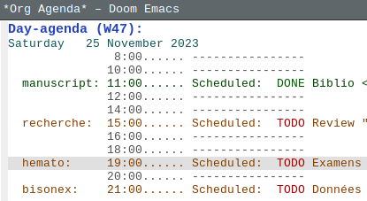

---
title: Research in org-mode (GTD, bibliography)
...

Here's is my current (simple) workflow for working in org-mode to do research by [staying organized with Org agenda](#staying-organized-with-org-agenda), [managing your bibliography](#bibliography-with-org-mode) and [write some papers](#writing-papers-org-mode-or-latex).

## Staying organized with Org agenda
Nicolas Rougier has a [very nice configuration](https://www.labri.fr/perso/nrougier/GTD/index.html) for implementing Getting Things Done (GTD) in emacs: 
But I prefer to only have the dasks for today in the agenda, like this:



For managing projects, I use the `CATEGORY` property (displayed left in org-agenda) and add tags for more details (displayed right in org-agenda). 

Adding new tasks is done through org-capture into an `inbox.org` file and refiled as soon as possible into a correct project drawer in `projects.org`. Here is the full configuration.
```
;;; Org config:
(setq org-directory "~/org/") ; Must be set before org loads. Other general config come later.

;; Use daily tasks as default
(after! org
  (setq org-agenda-files (list "inbox.org" "projects.org" "projects/thesis") ; My agenda files
        org-archive-location (concat org-directory "archive/%s_archive::") ; Archive folder
        org-agenda-start-day "today"
        org-agenda-span 'day ; One da is enough
        org-log-done 'time ; Store time when finishing a task
        org-refile-allow-creating-parent-nodes 'confirm)

  ;; Define capture for inbox tasks. As well as sports
  ;; To avoid putting newlines everywhere, mapconcat intersperse "\n" between list elements
  (setq org-capture-templates
        `(("i" "Inbox" entry  (file "inbox.org")
           "* TODO %?\n/Entered on/ %U")
          ("t" "Bisonex" entry  (file "projects/thesis.org")
           "* TODO %?\n/Entered on/ %U"))))
```

## Bibliography with org-mode
[citar](https://github.com/emacs-citar/citar) is a very nice way to add citations by simplying using `SPC m @` and typing parts of the author or title. Configuration:

    ;; Manage bibliography with citar (vertico is the default completion engine)
    (after! citar
      (setq! citar-bibliography '("~/research/biblio.bib" "~/research/bisonex/thesis/biblio.bib")
             citar-library-paths '("~/papers")
             citar-notes-paths '("~/research/references")))
Within Doom-emacs, pressing `ENTER` on a citation will give a choice : go to the URL, open the PDF or goes to a dedicated org-mode file containing your note.

Instead of having multiple org files (one per paper), Gregory J. Stein's post about [a single org-mode file containing annotated bibliography](https://cachestocaches.com/2020/3/org-mode-annotated-bibliography/).
From this org-file, you can export the bibliography in LaTeX with org-tangle.
With a custom elisp (or org-ref), you can easily add from a DOI bibtex code. 

    ;; From https://www.anghyflawn.net/blog/2014/emacs-give-a-doi-get-a-bibtex-entry/
    (defun get-bibtex-from-doi (doi)
      "Get a BibTeX entry from the DOI"
      (interactive "MDOI: ")
      (let ((url-mime-accept-string "text/bibliography;style=bibtex"))
        (with-current-buffer
            (url-retrieve-synchronously
             (format "http://dx.doi.org/%s"
                     (replace-regexp-in-string "http://dx.doi.org/" "" doi)))
          (switch-to-buffer (current-buffer))
          (goto-char (point-max))
          (setq bibtex-entry
                (buffer-substring
                 (string-match "@" (buffer-string))
                 (point)))
          (kill-buffer (current-buffer))))
      (insert (decode-coding-string bibtex-entry 'utf-8))
      (bibtex-fill-entry))


In practice, I found it a bit cumbersome to add manually the org-structure with the title. My current workflow exploit org-bibtex to convert bibtex code into org-mode structure ! After generating the bibtex with the previous code, I cut the bibtex then cadd `org-bibtex-yank`. It will give

    * From FastQ Data to High‐Confidence Variant Calls: The Genome Analysis Toolkit Best Practices Pipeline
    :PROPERTIES:
    :TITLE:    From FastQ Data to High‐Confidence Variant Calls: The Genome Analysis Toolkit Best Practices Pipeline
    :BTYPE:    article
    :CUSTOM_ID: vanDerAuwera2013
    :VOLUME:   43
    :ISSN:     1934-340X
    :URL:      http://dx.doi.org/10.1002/0471250953.bi1110s43
    :DOI:      10.1002/0471250953.bi1110s43
    :NUMBER:   1
    :JOURNAL:  Current Protocols in Bioinformatics
    :PUBLISHER: Wiley
    :AUTHOR:   Van der Auwera, Geraldine A. and Carneiro, Mauricio O. and Hartl, Christopher and Poplin, Ryan and del Angel, Guillermo and Levy‐Moonshine, Ami and Jordan, Tadeusz and Shakir, Khalid and Roazen, David and Thibault, Joel and Banks, Eric and Garimella, Kiran V. and Altshuler, David and Gabriel, Stacey and DePristo, Mark A.
    :YEAR:     2013
    :MONTH:    Oct
    :END:

Then call `org-bibtex` to generate the final bibtex file.

## Writing papers : org-mode or LaTeX ?
It is possible to write a full manuscript in org-mode, see Daniel Gomez's [repository on Github](https://github.com/dangom/org-thesis) example.
It allows to fully concentrate on the content as writing in full LaTeX makes it harder due to the extra formatting. However, set-up can be a bit cumbersume and collaborating with others in not easy.

My current setup is to write the outline and most of the content in org-mode, then export to latex and upload it to Overleaf.
