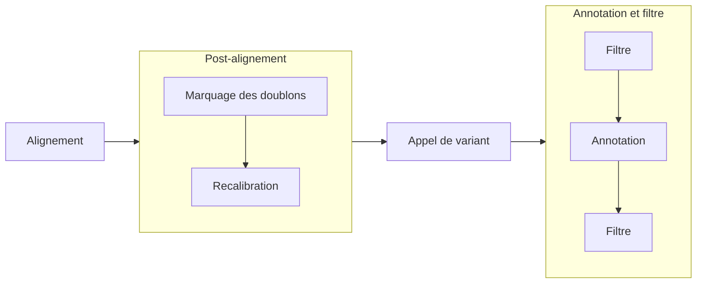

# BisonEx
## Un pipeline bioinformatique de ré-interprétation d’analyses constitutionnelles d’exome 

CHU Minjoz, Besançon
<!--
Remercier jury + public
-->

---
section: Introduction
---

# Plan
1. Contexte
2. Reproductibilité, portabilité et performance
3. Validation
4. Réinterprétation

---
---

# Contexte

- Consultations de maladies rares (Centre de Génétique Humaine)
- _Exome_ souvent prescrit après un premier bilan
    - 1% de l'ADN
    - rendement diagnostic 32% 
    - sous-traité à un laboratoire privé accrédité

<!--
Maladies rares par opposition aux cancers
Depuis 2017, bilan "débrouillage" : ACPA/caryotype

1% = codant pour des protéines => rôle important et d'ailleur rendement diagnostic intéressant (mais dépend des malades)

-->

---
layout: image-right
image: /img/ngs.svg
backgroundSize: 100%
---

# Contexte

Patients en errance diagnostique
- ré-intérpréter données existantes <v-click> **disponibles depuis 2022** </v-click>
- ré-analyser données brutes : <v-click> **pipeline maison** </v-click> <v-click> (v0.1 par Dr. A. Overs) </v-click>

<!--
Errance = sans diag :  soit pas de cause génétique, soit limite technologique ou scientifique
- Intéressant de regarder les données déjà ré-analysées (ex: nouveaux gènes) -> ok
- Idéal = notre propre pipeline -> déjà développé

Décrire figure puis dire où on se place
- non utilisable par un humain (volume trop important): nécessité d'un traitement bioinformatique
- détermine différence par rapport à une référence (= variants)
- filtre (millions candidations -> 1000 candidates)
- besoin d'un biologiste (> IA not. expérience)
-->

---
---

# Pipeline

---
layout: image-right
image: /img/dependencies.svg
backgroundSize: 100%
section: Reproductibilité, portabilité
---
# Reproductibilité

Comment assurer au COFRAC des résultats reproductibles ?

 
<v-click>

**Nix**

</v-click>

<v-clicks every="1">

1. bloque la version de tous les logiciels
2. quelque soit l'ordinateur (Linux +/- OSX)

</v-clicks>

<!--
- pour avoir une expérience reproductible, il faut déjà un environnement logiciel qui le soit !

1.  SH-GTA-16: version définie de tous les logiciels et une mise à jour implique une requalification
 pas de mise à jour sauvage !

2. en cas de panne, on veut retrouver exactement le même environnement

nix répond à cette problématique (exactement)
-->

---
layout: image-right
image: /img/pullrequests.svg
backgroundSize: 100%
---
# Reproductibilité

Incorporation dans Nix :
- 6 logiciels "empaquetés" + 3 dépendences
- 3/6 déjà utilisables par la communauté (nixpkgs)

<!--
packaging  
Apport: appel de variant (gatk), annotation (vep), score d'épissage (spip), 
2 outils important pour comparer les résultats à des réference

open-source
utilisable via un dépôt commun (nixpkgs)
processus long

actullement: spip vep et multiqc en attente
-->

---
layout: image-right
image: /img/executors.png
backgroundSize: 85%
---

# Portabilité 

**Nextflow**

<v-clicks every="1">

- Maîtrise des risques liés au matériel
- Exécution sur de multiple architecture (super-calculateur...)

</v-clicks>

<!--
principe: définir chaque bloc de calcul dans un langage qui est indépendant de l'architecture.

En pratique, cela permet de répondre en partie au  SH-GTA-16 
"en cas d’incident perturbant l’exécution du pipeline ou le
transfert des fichiers ainsi que des procédures de récupération/sauvegarde des
données en cas de perte." 
-> restart automatique depuis le dernier "bloc" exécuté

Et permet de s'exécuter sur de nombreuses architectures !
-->

---
layout: image-right
image: /img/speedup.svg
backgroundSize: 100%
---

# Performances

- Mésocentre de Franche-Comté
- Parallélisation de l'alignement
- 1 patient = 5h de calcul
- 20 patients/jour

<!--
Application de nextflow sur supercalculateur 

2 étapes les plus coûteuses = alignement, appel de variant
alignement = trivialement parallélisable
appel de variant = exploitation du processeur mais parallélisation non faite pour le moment

Pour donner une idée, 12h de calcul sur un portable
-->

---
section: Validation
---

# Validation  

- "Gold standard" sur patients de référence (Genome In A Bottle Consortium)
- *In silico*

<!--
GIAB: séquencage de plusieurs patients, chacun sur plusieurs technologies. 
définition de variants de référence sur des intervalles de confiance
permet de définir des vrais positifs, faux positifs, faux négatifs -> calcul de performance
-->

---
---
# Séquencage et pipeline

Patient NA12878
- ADN commandé à Corriel
- séquencé à Centogène
- analysé par notre pipeline

 

| Type | Sensibilité| Valeur Prédictive Positive  |
|------|------------|-----------------------------|
| Indel| 0.954      | 0.775                       | 
| SNV  | 0.983      | 0.965                       | 

<!--
Bon résultats pour SNV (définir)
Indel: performances moindres, surtotu du à un nombre de faux positifs, 
qui ne sont pas du à une discordance sur le gène ou l'allèe
Surtout des petites délitino 1-5bp
-->

---
layout: image-right
image: /img/giab_both_run.svg
backgroundSize: 100%
---
# Pipeline

- 7 Patients GIAB
- Séquencage par Google (Baid et al. 202) :
  - 3 kits de capture
  - 2 séquenceurs (HiSeq4000, Novaseq)
  - alignement et appel de variant identiques
<!--
Ici pipeline seul
Données google intéressantes car nombreuses possibiliés (capture, séquenceur, patient). En résumé 

Bisonex semble plus performant: impact du génome de réference (version avec ALT ?)
illuste problème de la reproductibilité
-->

---
layout: image-right
image: /img/varben.png
backgroundSize: 95%
---
# In silico

- Patient de synthèse avec **varben**
- 126 variants confirmés en Sanger
  - 1 non inséré
  - 1 filtré sur la profondeur (21 < 30)
  - 124 retrouvés 

<!--
13 homozygotes classifiés hétérozygotes
-->

---
---
# In silico

Données simulées avec **simuscop**

- 126 même variants
  - 1 non appelé (3 read sur 34)
  - 1 manqué
  - 2 en dehors du kit de capture
  - 122 retrouvés
<!--
7 étiquetés htz au lieu d'hmz
-->

---
section: Réinterprétation
---

# Non-infériorité

---
---

# Nouveaux diagnostics

