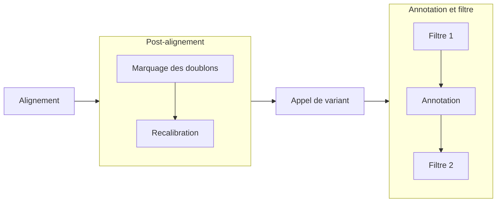
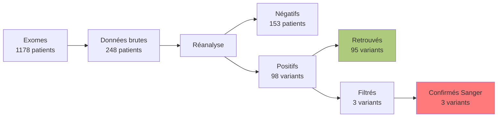

# BisonEx
## Un pipeline bioinformatique de ré-interprétation d’analyses constitutionnelles d’exome 

Laboratoire de Génétique, CHU Minjoz, Besançon
<!--
Remercier jury + public
-->

---
section: Introduction
---

# Contexte

- Consultations de maladies rares (Centre de Génétique Humaine)
- _Exome_ souvent prescrit après un premier bilan
    - 1% de l'ADN
    - rendement diagnostic 30-50% (selon indication)
    - sous-traité à un laboratoire privé accrédité

<!--
Maladies rares par opposition aux cancers
Depuis 2017, bilan "débrouillage" : ACPA/caryotype

1% = codant pour des protéines => rôle important et d'ailleur rendement diagnostic intéressant (mais dépend des malades)

-->

---
layout: image-right
image: /img/ngs.png
backgroundSize: 100%
---

# Contexte

Patients en errance diagnostique

<v-clicks every="1">

- ré-interprétation à la demande 
- données brutes **depuis 2022** 
- **pipeline maison** (v0.1 par Dr. A. Overs) 

</v-clicks>
<!--
Errance = sans diag :  soit pas de cause génétique, soit limite technologique ou scientifique
- Intéressant de regarder les données déjà ré-analysées (ex: nouveaux gènes) -> ok
- Idéal = notre propre pipeline -> déjà développé

Décrire figure puis dire où on se place
- non utilisable par un humain (volume trop important): nécessité d'un traitement bioinformatique
- détermine différence par rapport à une référence (= variants)
- filtre (millions candidations -> 1000 candidates)
- besoin d'un biologiste (> IA not. expérience)
-->

---
---

# Pipeline

<!-- Les "3 A"

Doublons = reads qui sont probablement des doublons des fragments d'ADN originel (artefact)
Recalibration: détecter et corriger les erreurs systématiques dans les scores de qualité (donnés par le séquencaire)

NB: Biais possible = biochimique (libraire, séquencage), du séquenceur lui-mêm...
En pratique, on fait un modèle à partir des mesures et on ajuste en fonction

Précisions pour les questions
Filtre 1 = profondeur <= 30, nb reads porteur <= 10 et variants dans dbSNP non rare (MAF >= 0.01) et non pathologique selon clinvar
Filtre 2 = on enlève les variants non codants, intergénique, UTR, intronique, pseudogène, micro ARN sauf si score d'épissage > 
-    spip.cutoff = 30
-    spliceai.cutoff = 0.2

 -->

---
---

# Objectifs de cette thèse

1. Pipeline reproductible, portable, performant
2. Validation (patients de réference, *in silico*)
3. Ré-analyse des exomes négatifs

---
layout: image-right
image: /img/dependencies.svg
backgroundSize: 100%
section: Reproductibilité, portabilité
---
# 1. Reproductibilité

Comment assurer au COFRAC des résultats reproductibles ?

 
<v-click>

**Nix**

</v-click>

<v-clicks every="1">

1. bloque la version de tous les logiciels
2. quelque soit l'ordinateur (Linux +/- OSX)
3. environnement logiciel de "production" identique à celui validation
</v-clicks>

<!--
- pour avoir une expérience reproductible, il faut déjà un environnement logiciel qui le soit !

1.  SH-GTA-16: version définie de tous les logiciels et une mise à jour implique une requalification
 pas de mise à jour sauvage !

2. en cas de panne, on veut retrouver exactement le même environnement

nix répond à cette problématique (exactement)
-->

---
layout: image-right
image: /img/pullrequests.svg
backgroundSize: 100%
---
# 1. Reproductibilité

Incorporation dans Nix :
- 6 logiciels + 3 dépendences
- 3/6 déjà utilisables par la communauté (nixpkgs)

<!--
Graphique : soumissions à la communité avec le délai entre la soumission initiale et l'acceptation
Certains ont été longs...

Apport sur des outils importants non disponibles !: appel de variant (gatk), annotation (vep), score d'épissage (spip), 
2 outils important pour comparer les résultats à des réference

open-source
utilisable via un dépôt commun (nixpkgs)

actullement: spip, vep et multiqc en attente
-->

---
layout: image-right
image: /img/executors.png
backgroundSize: 85%
---

# 1. Portabilité 

**Nextflow**

<v-clicks every="1">

- Maîtrise des risques liés au matériel
- Exécution sur de multiples architectures (super-calculateur...)

</v-clicks>

<!--
principe: définir chaque bloc de calcul dans un langage qui est indépendant de l'architecture.

En pratique, cela permet de répondre en partie au  SH-GTA-16 
"en cas d’incident perturbant l’exécution du pipeline ou le
transfert des fichiers ainsi que des procédures de récupération/sauvegarde des
données en cas de perte." 
-> restart automatique depuis le dernier "bloc" exécuté

Et permet de s'exécuter sur de nombreuses architectures !
-->

---
layout: image-right
image: /img/speedup.svg
backgroundSize: 100%
---

# 1. Performances

- Mésocentre de Franche-Comté
- Parallélisation de l'alignement
- 1 patient = 5h de calcul
- 20 patients/jour

<!--
Application de nextflow sur supercalculateur 

2 étapes les plus coûteuses = alignement, appel de variant
alignement = trivialement parallélisable
appel de variant = exploitation du processeur mais parallélisation non faite pour le moment

Pour donner une idée, 12h de calcul sur un portable
-->

---
section: Validation
---

# 2. Validation  

- "Gold standard" sur patients de référence (Genome In A Bottle Consortium)
- *In silico*

<!--
GIAB: séquencage de plusieurs patients, chacun sur plusieurs technologies. 
définition de variants de référence sur des intervalles de confiance
permet de définir des vrais positifs, faux positifs, faux négatifs -> calcul de performance
-->

---
---
# 2. Validation: séquencage et pipeline

Patient NA12878
- ADN commandé à Coriell
- séquencé à Centogène
- analysé par notre pipeline

 

| Type | Sensibilité| Valeur Prédictive Positive  |
|------|------------|-----------------------------|
| Indel| 0.954      | 0.775                       | 
| SNV  | 0.983      | 0.965                       | 

<!--
Bon résultats pour SNV (définir)
Indel: performances moindres, surtotu du à un nombre de faux positifs, 
qui ne sont pas du à une discordance sur le gène ou l'allèe
Surtout des petites délétions 1-5bp

rappel: sensibilité = vrais positifs / faux négatifs + vrais positifs (= proba test + si malade)
VPP = VP/VP + FP (probal avoir maladie si test+)
-->

---
layout: image-right
image: /img/giab_both_run.svg
backgroundSize: 100%
---
# 2. Validation : pipeline

- 7 Patients GIAB
- Google (Baid et al. 2022)
  - 3 kits de capture
  - 2 séquenceurs (HiSeq4000, Novaseq)
  - alignement et appel de variant identiques
<!--
Ici pipeline seul
Données google intéressantes car nombreuses possibiliés (capture, séquenceur, patient). En résumé 

Bisonex semble plus performant: impact du génome de réference (version avec ALT ?)
Version des logiciels non mentionnées
illuste problème de la reproductibilité
-->

---
layout: figure-side
figureUrl: /img/varben.png
---

# 2. Validation : *in silico* 

- Patient de synthèse avec **varben**
- 126 variants confirmés en Sanger
  - 1 non inséré
  - 1 filtré sur la profondeur (21 < 30)
  - 124 retrouvés 

<!--
- 1 non inséré car nombre de reads insuffisants
- 13 homozygotes classifiés hétérozygotes mais problème de l'outil de compairaison (AF >= 0.8 pourtant...)
-->

---
---
# 2. Validation : *in silico* 

Données simulées avec **simuscop**

- 126 même variants
  - 1 non appelé (3 read sur 34)
  - 3 non insérés 
  - 122 retrouvés
<!--
2 en dehors du kit de capture = rendu par le sous-traitant mais en dehors de celui qui s'approche le plus...
1 non inséré (non exploré)
7 étiquetés htz au lieu d'hmz TODO 
-->

---
section: Réinterprétation
---

# 3. Réinterprétation: non-infériorité

<v-click every="1">

- 2 variants filtrés sur la profondeur (*CHD3*,  *RRAS2*)
- 1 variant filtré sur le nombre de reads porteurs (*PITX3*)

</v-click>

<!--

CHD3 = sd Snijdrer Blok-Cameau (neurodev, macrocéphplie, dysmorphie). Patient : dysmoprhie, neurdev
RRAS2 = noondan 12 (macrocéphalie, hypertélorisme...). Rendu VOUS (patient avec nerf optique, retard motoreu, hydrocéphalie)
PITX3 = cataracte. Patient: cataracte, trouble appretissage, réflexe . Rendu VOUS

VOUS... on peut descendre un peu les filtres
Gène      Profondeur  Reads porteurs 
*CHD3*    **27**          22             
*PITX3*   34          **8**              
*RRAS2*   **29**          14             

-->

---
---

# 3. Réinterprétation: nouveaux diagnostics

1 probable diagnostic sur *ADNP* 

 
 
 
 
 
 

- très peu fréquent gnomAD
- tronquant sur gène perte de fonction
- clinvar pathologique
- syndrome Helsmoortel-Van der Aa

<!--
- score de pathogénicité : CADD=32
ADNP = syndrome Helsmoortel-Van der Aa syndrome (HVDAS): 
- trouble neurodévelopement : retard de dev intellect, moteur, TSA, dysmorphie faciale, hypotonie, cardiaque, diff. visuelle.
- patient: retard language, hypertonie (Anne-Laude)

pli = basé sur l'observation de la "depletion" de variant perte de fonction dans gnomad
gnomad = aggrégation d'exome et de génome dans une population sans cohortes avec maladies pédiatriques
-->

---
---

# 3. Réinterprétation: nouveaux diagnostics

- 2 variants intéressants *KCNQ2*, *MED13*
- 1 signification indéterminée (*SPEN*)

<!--

*KCNQ2*, : faux-sens modifiant l'épissage, gain de fonction ?
*MED13* : faux-sens modifiant l'épissage, perte de fonction ?

KCNQ2
- continuum : épilepsine néonatales mais plus rarement DI isolée décrite
- patient : DI, retard de langugae (Anne-Laude)
- phénotype décrit pour un *gain* de fonction

MED13: DI avec autres caractéristiques très variables
- patient: DI, morpho rein-foie (Anne-Laude)

SPEN: sd Radio-Tartaglia = neurodev, hyptonie, dysorphie, parfois malfo cardique
- foetus avec malfo cardiaque, plagiocéphalie
-->

---
layout: center
---

# Conclusion

<v-clicks every="1">

- Pipeline reproductible, portable, performant
- Validation : résultats encourageants
- 3 variants prometteurs
- Nombreux axes d'amélioration (T2T, oligénisme...)

</v-clicks>

<!--
T2T = dire simplement nouveau génome (8% du génome)
-->

<v-click>

**Merci de votre attention !**

</v-click>

<!--
Nombreuses améliorations possibles
Validation: faire passer tous les tests
Nouveaux diag à creuser
Étude impact du génome de réference

-->
