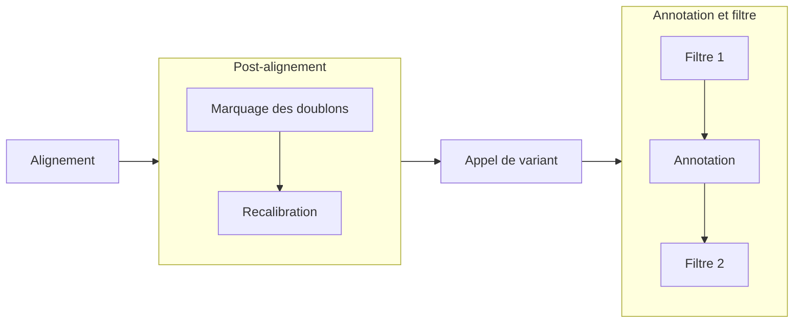
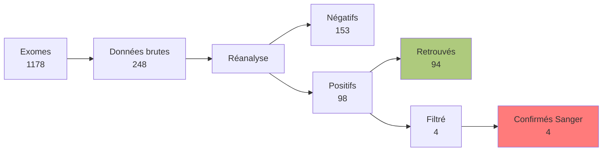

# BisonEx
## Un pipeline bioinformatique de ré-interprétation d’analyses constitutionnelles d’exome 

Laboratoire de Génétique, CHU Minjoz, Besançon
<!--
Remercier jury + public
-->

---
section: Introduction
---

# 1. Contexte

- Consultations de maladies rares (Centre de Génétique Humaine)
- _Exome_ souvent prescrit après un premier bilan
    - 1% de l'ADN
    - rendement diagnostic 32% 
    - sous-traité à un laboratoire privé accrédité

<!--
Maladies rares par opposition aux cancers
Depuis 2017, bilan "débrouillage" : ACPA/caryotype

1% = codant pour des protéines => rôle important et d'ailleur rendement diagnostic intéressant (mais dépend des malades)

-->

---
layout: image-right
image: /img/ngs.png
backgroundSize: 100%
---

# 1. Contexte

Patients en errance diagnostique

<v-clicks every="1">

- ré-interprétation à la demande 
- données brutes **disponibles depuis 2022** 
- **pipeline maison** (v0.1 par Dr. A. Overs) 

</v-clicks>
<!--
Errance = sans diag :  soit pas de cause génétique, soit limite technologique ou scientifique
- Intéressant de regarder les données déjà ré-analysées (ex: nouveaux gènes) -> ok
- Idéal = notre propre pipeline -> déjà développé

Décrire figure puis dire où on se place
- non utilisable par un humain (volume trop important): nécessité d'un traitement bioinformatique
- détermine différence par rapport à une référence (= variants)
- filtre (millions candidations -> 1000 candidates)
- besoin d'un biologiste (> IA not. expérience)
-->

---
---

# 1. Pipeline

<!-- Les "3 A"

Doublons = reads qui sont probablement des doublons des fragments d'ADN originel (artefact)
Recalibration: détecter et corriger les erreurs systématiques dans les scores de qualité (donnés par le séquencaire)

NB: Biais possible = biochimique (libraire, séquencage), du séquenceur lui-mêm...
En pratique, on fait un modèle à partir des mesures et on ajuste en fonction

Précisions pour les questions
Filtre 1 = profondeur <= 30, nb reads porteur <= 10 et variants dans dbSNP non rare (MAF >= 0.01) et non pathologique selon clinvar
Filtre 2 = on enlève les variants non codants, integnéique, UTR, intronique, pseudogène, micro ARN sauf si score d'épissage > 
-    spip.cutoff = 30
-    spliceai.cutoff = 0.2

 -->

---
layout: image-right
image: /img/dependencies.svg
backgroundSize: 100%
section: Reproductibilité, portabilité
---
# 2. Reproductibilité

Comment assurer au COFRAC des résultats reproductibles ?

 
<v-click>

**Nix**

</v-click>

<v-clicks every="1">

1. bloque la version de tous les logiciels
2. quelque soit l'ordinateur (Linux +/- OSX)
3. environnement logiciel de "production" identique à celui validation
</v-clicks>

<!--
- pour avoir une expérience reproductible, il faut déjà un environnement logiciel qui le soit !

1.  SH-GTA-16: version définie de tous les logiciels et une mise à jour implique une requalification
 pas de mise à jour sauvage !

2. en cas de panne, on veut retrouver exactement le même environnement

nix répond à cette problématique (exactement)
-->

---
layout: image-right
image: /img/pullrequests.svg
backgroundSize: 100%
---
# 2. Reproductibilité

Incorporation dans Nix :
- 6 logiciels + 3 dépendences
- 3/6 déjà utilisables par la communauté (nixpkgs)

<!--
Graphique : soumissions à la communité avec le délai entre la soumission initiale et l'acceptation
Certains ont été longs...

Apport sur des outils importants non disponibles !: appel de variant (gatk), annotation (vep), score d'épissage (spip), 
2 outils important pour comparer les résultats à des réference

open-source
utilisable via un dépôt commun (nixpkgs)

actullement: spip, vep et multiqc en attente
-->

---
layout: image-right
image: /img/executors.png
backgroundSize: 85%
---

# 2. Portabilité 

**Nextflow**

<v-clicks every="1">

- Maîtrise des risques liés au matériel
- Exécution sur de multiples architectures (super-calculateur...)

</v-clicks>

<!--
principe: définir chaque bloc de calcul dans un langage qui est indépendant de l'architecture.

En pratique, cela permet de répondre en partie au  SH-GTA-16 
"en cas d’incident perturbant l’exécution du pipeline ou le
transfert des fichiers ainsi que des procédures de récupération/sauvegarde des
données en cas de perte." 
-> restart automatique depuis le dernier "bloc" exécuté

Et permet de s'exécuter sur de nombreuses architectures !
-->

---
layout: image-right
image: /img/speedup.svg
backgroundSize: 100%
---

# 2. Performances

- Mésocentre de Franche-Comté
- Parallélisation de l'alignement
- 1 patient = 5h de calcul
- 20 patients/jour

<!--
Application de nextflow sur supercalculateur 

2 étapes les plus coûteuses = alignement, appel de variant
alignement = trivialement parallélisable
appel de variant = exploitation du processeur mais parallélisation non faite pour le moment

Pour donner une idée, 12h de calcul sur un portable
-->

---
section: Validation
---

# 3. Validation  

- "Gold standard" sur patients de référence (Genome In A Bottle Consortium)
- *In silico*

<!--
GIAB: séquencage de plusieurs patients, chacun sur plusieurs technologies. 
définition de variants de référence sur des intervalles de confiance
permet de définir des vrais positifs, faux positifs, faux négatifs -> calcul de performance
-->

---
---
# 3. Validation: séquencage et pipeline

Patient NA12878
- ADN commandé à Coriell
- séquencé à Centogène
- analysé par notre pipeline

 

| Type | Sensibilité| Valeur Prédictive Positive  |
|------|------------|-----------------------------|
| Indel| 0.954      | 0.775                       | 
| SNV  | 0.983      | 0.965                       | 

<!--
Bon résultats pour SNV (définir)
Indel: performances moindres, surtotu du à un nombre de faux positifs, 
qui ne sont pas du à une discordance sur le gène ou l'allèe
Surtout des petites délitino 1-5bp
-->

---
layout: image-right
image: /img/giab_both_run.svg
backgroundSize: 100%
---
# 3. Validation

- 7 Patients GIAB
- Google (Baid et al. 2022)
  - 3 kits de capture
  - 2 séquenceurs (HiSeq4000, Novaseq)
  - alignement et appel de variant identiques
<!--
Ici pipeline seul
Données google intéressantes car nombreuses possibiliés (capture, séquenceur, patient). En résumé 

Bisonex semble plus performant: impact du génome de réference (version avec ALT ?)
illuste problème de la reproductibilité
-->

---
layout: image-right
image: /img/varben.png
backgroundSize: 95%
---
# In silico

- Patient de synthèse avec **varben**
- 126 variants confirmés en Sanger
  - 1 non inséré
  - 1 filtré sur la profondeur (21 < 30)
  - 124 retrouvés 

<!--
13 homozygotes classifiés hétérozygotes
-->

---
---
# In silico

Données simulées avec **simuscop**

- 126 même variants
  - 1 non appelé (3 read sur 34)
  - 1 manqué
  - 2 en dehors du kit de capture
  - 122 retrouvés
<!--
7 étiquetés htz au lieu d'hmz
-->

---
section: Réinterprétation
---

# Non-infériorité

<v-click>

- 3 variants filtré sur la profondeur (*CHD3*, *GABRA5*, *RRAS2*)
- 1 variant sur le nombre de reads porteurs (*PITX3*)

</v-click>

<!--

Gène      Profondeur  Reads porteurs 
*CHD3*    **27**          22             
*PITX3*   34          **8**              
*GABRA5*  **15**          6              
*RRAS2*   **29**          14             

-->

---
layout: two-cols
---

# Nouveaux diagnostics

1 Variant de Signification Indéterminé sur *SPEN*

- Foetus avec malformation cardiaque
- Radio-Tartaglia syndrome 
  - malformation cardiaque possible
  - pas de foetus décrit
::right::

#

<!--
Stratégie : nouveau "clinical synopsis" dans OMIM sur exome neg

1 fois dans clinvar, vous
non présent dans gnomad4 genome et < 1e-5 dans gnomadexome
qq score bioinfo en faveur (CADD)
probablement pas d'atteinte de l'épissage (spip, spliceai)

a neurodevelopmental disorder characterized by global developmental delay with impaired intellectual development, speech delay, and variable behavioral abnormalities. Affected individuals show 
hypotonia, mild motor difficulties, and craniofacial dysmorphism. Brain imaging may show nonspecific defects; rare patients have seizures or pyramidal signs. A subset of individuals may have congenital heart defects, precocious puberty, and obesity in  
Syndrome décrit en 2021
- trouble du neurodeveloppement, dysmorphie craniofaciale
- certains ont une malformation cardique

Abnormal plantar dermatoglyphics; Antenatal onset; Hypoplastic right heart; Increased nuchal translucency;
Plagiocephaly; Tricuspid stenosis

Ségrégation en cours...
-->

---
layout: center
---

# Conclusion

- Reproductible
- Portable
- Performant
- Validation à affiner
- Recherche nouveaux diagnostics en cours

<v-click>

**Merci de votre attention !**

</v-click>

<!--
Nombreuses améliorations possibles
Validation: faire passer tous les tests
Nouveaux diag à creuser
Étude impact du génome de réference

-->
