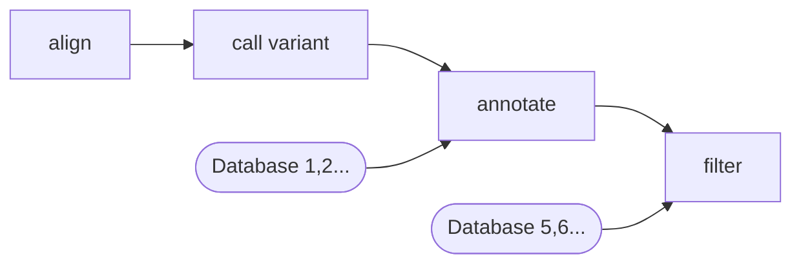
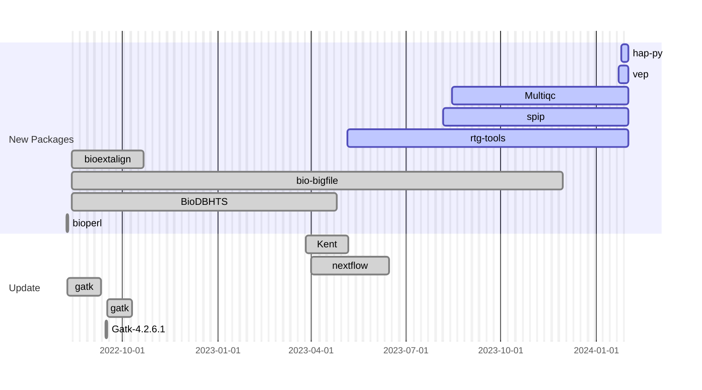

# Nix for genetics
## Powering a bioinformatics pipeline

Alexis Praga (M. D, Ph.D in Computer Science)

Besançon Hospital (France)
<!--
We are dealing with real world patients =
- accurate results : no mistake is allowed (diagnosis can be life changing)
- reproducible : we need to have the trust of other doctors
- fast : increasing demand !

Rare diseases 
- ... are rare : how to diagnosis things you don't see often ?
- mix of state-of-the art technology, computer science and human expertise
-->

---
transition: fade-out
layout: center
---

# Next-generation sequencing

 

 
 
Bioinformatics: 1 million -> 1 000 candidates

<!--
- How does that work in practice ?
- We start from a blood sample. DNA is then extracted and "sequenced" (getting the DNA code)
- Raw data cannot be used on its own so it needs to be processed and filtered.
- The final output is a dataframe (i.e CSV) than a human can examine and try to find the diagnosis.
- We still a human (no AI)
- And bioinformatics is super important : if we filter too much, we miss the diagnosis. Not enough and the human won't be able to read the data.
-->

---
layout: two-cols-header
---

# Bioinformatics pipeline

::right::

# Nix ? 

- Reproducible dependencies : ok ! (it's the law)
- High Performance Computing : ok !
- Manage workflow ?
- Manage databases ?

<!--

Quite simple : a set of command-line utilites that process (compressed) text data

External databases are basically text file .

How does nix fit into this ?
- hard-coded software version and dependencies -> that's an obligation for the laboratory. A small update means to run all checks... and there are expensive
- database could be managed ... but there are stored in a different folder. In theory it could be done (has been added a few month agay)
- manage execution ?
-->

---

# Nix : excellent community

<!--

- Very welcoming (Element, github)
- Several packages contributed upstream (some waiting)
- Not easy as in my spare time + 5k in github

-->

---
layout: quote
class: "text-center"
---

# Thank you !

And to: 

Besançon Hospital

Mésocentre de calcul de Franche-Comté

 
 
Contact: alexis.praga (at) proton.me

 
 

<Transform :scale="0.5">
Images courtesy of Flaticon
</Transform>
