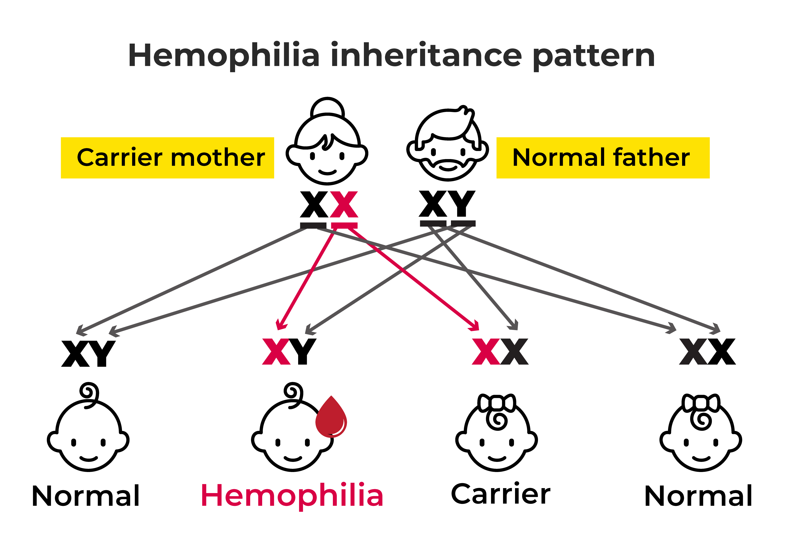
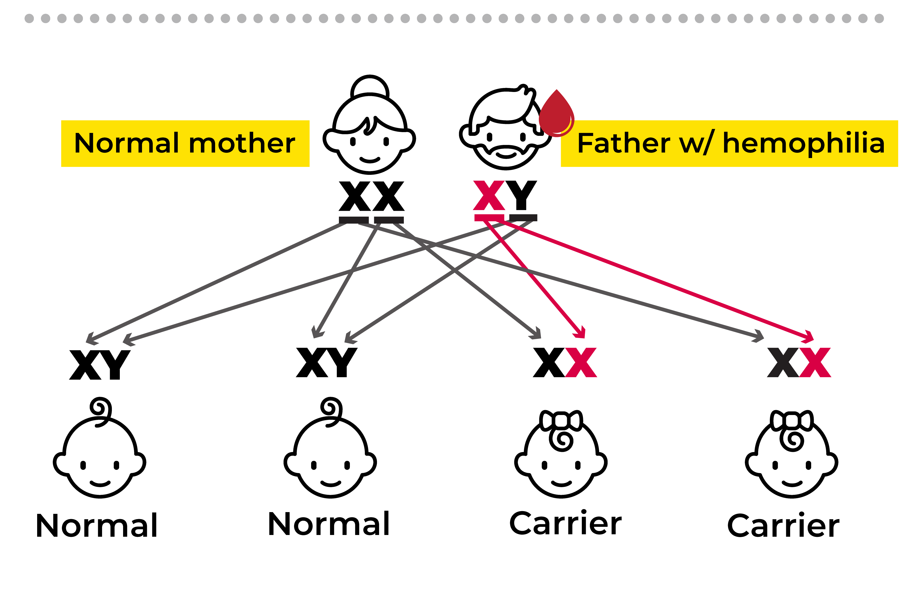
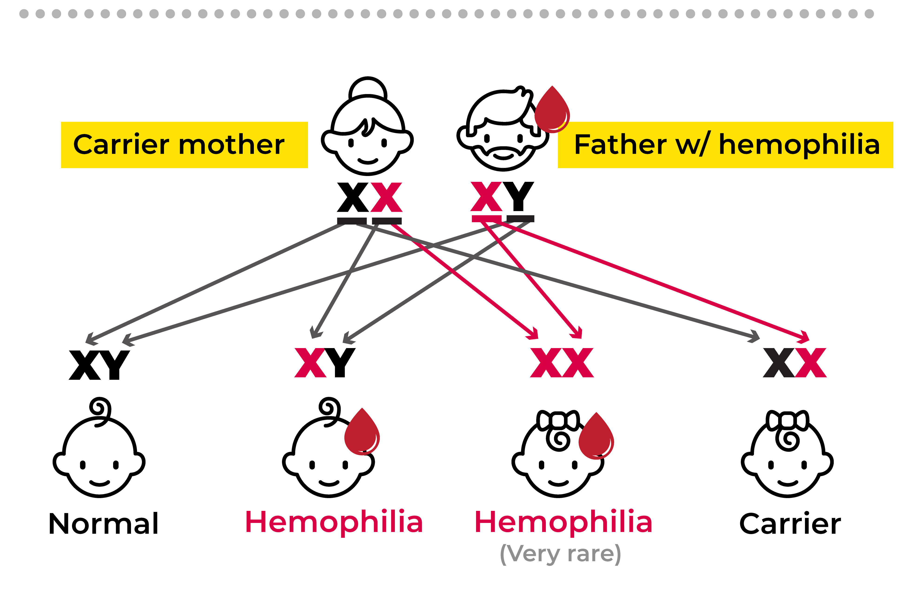
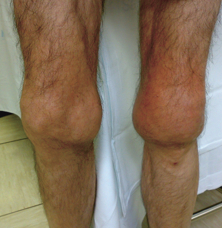
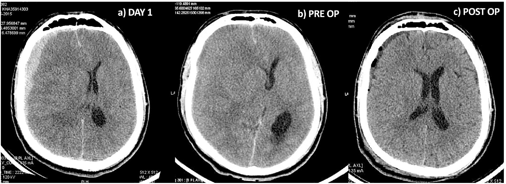
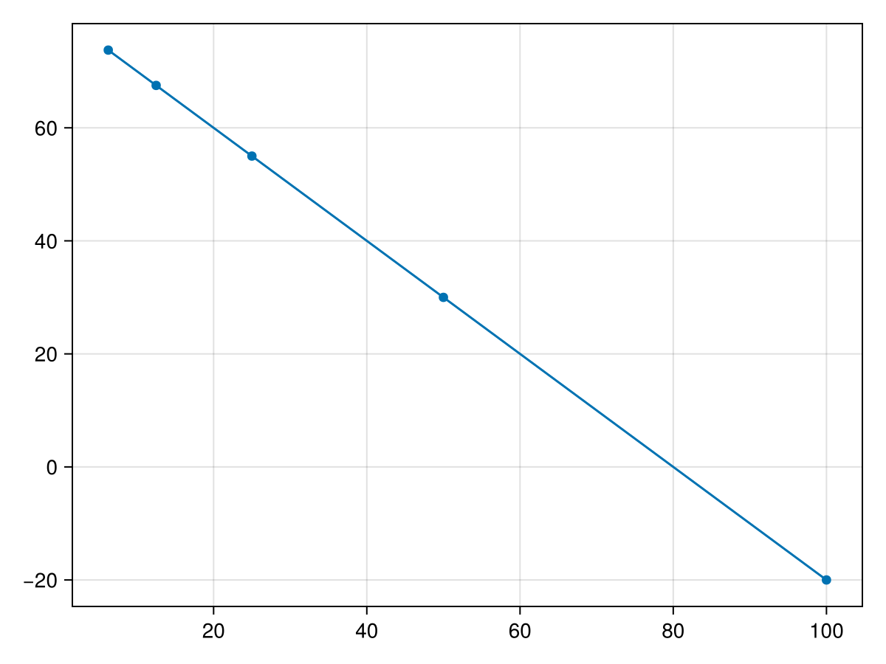
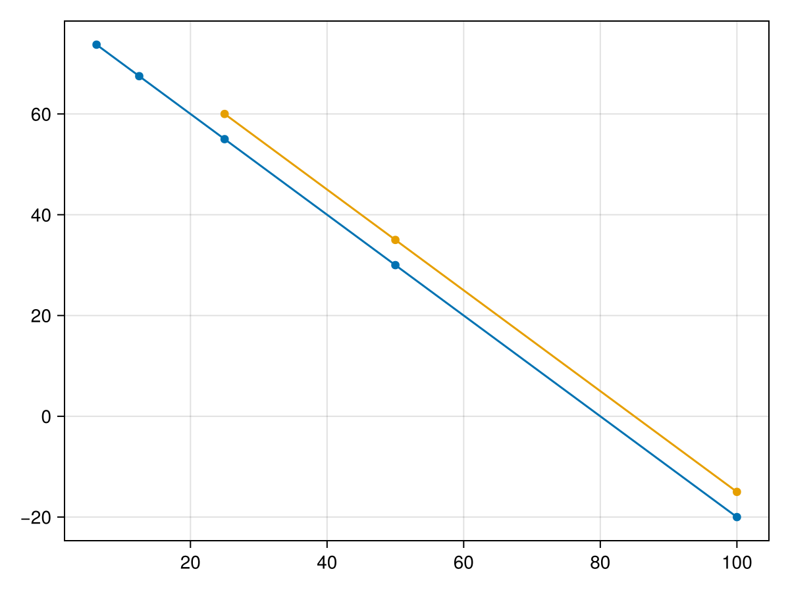
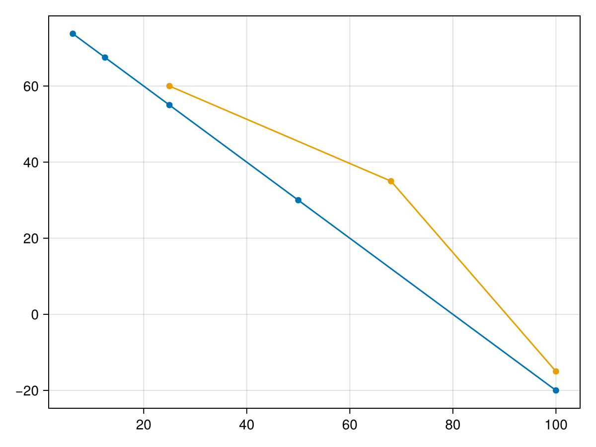

---
title: Hémophilie A et A
author: Alexis Praga
date: 2024-04-11
...

# Définition

Déficit en facteur

- VIII (antithromobiphlia) -> type A
- IX (antithromobiphlia type B) -> type B

# Génétique

Sur le chromosome X donc

- Garçon : atteint
- Fille : conductrice, parfois atteinte

# Génétique

# Génétique

# Génétique

::: notes

  - si homozygote (mère porteuse + père hémophile)
  - si hétérozygote avec inactivation partielle (détailler principe)

:::

# Génétique

Chromosome X:

- /F8/ = gène codant pour le ... facteur VIII
- /F9/ = pour le facteur IX

Génétique indispensable : étude familiale + détection conductrices

::: notes 

inversion intron 22 souvent retrouvé dans les formes sévères de l'hémophilie A

 (mesurer le taux de suffit pas !)

:::

# Clinique

Selon le taux de facteur

- < 1% = sévère : 24-48 épisodes par an, hémorragie spontanée
- 1-5% = mmodéré : 4-6 / an, sur traumatisme mineur
- >5 et < 10%: sur traumatisme important/chirurgie

::: notes

sévère: hémorragie spontanée articulation + tissus. Si chir/trauma : hémorragie abondante

A = un peu plus de cas sévères (60% vs 20-45% pour B)

:::

# Clinique: quand y penser ?

Début (si sévère)

- sévère : 9-18mois chez garçon
- modéré : 2-5 ans

- pas d'antécédent familiaux mais hémorragie intracrânielle chez nouveaux né
- saignement circoncision 

# Clinique

::: notes

Hémarthrose: genou++ puis coudes, chevilles, épaules, hanche
clinique: en aigùe, douloureux, chaud, gonflé -> peut être confondu avec infection !
ttt = reste, ice, factor, elevation
si récurrent oun non traivé : cartilage aboné, érosion os, puis avec le poids, subluxation, déformation permanente

:::

# Clinique

::: notes

docteur de 32 ans hémophile A, aux urgences, opéré avec facteur VIII à 100% après injection

Hegde et al 2016 
https://doi.org/10.1016/j.ijscr.2016.10.046

:::

# Clinique : mais aussi...

- hématome intra-musculaire
- hématome rétropéritonéal 
- mucqueuses, gastrointestinal, génitourinaire
- intracérébral !!

::: notes

30% hématome intramusculation 
- après injection IM
- non mortel mais atteinte sensorielle/motrice si syndrome des loges syndrome des loges (augmenttaion de la pression ) = urence médicalle !

rétropéritonéal: patient incapable de se tenir droit. Risque = déformation permantente (attente nerfs)

10% des patients ont hémorragie IC (risque 2%) soit spontané soit traumatique (décès 30%)

:::

Principe traitement : prévention atteinte articulaire, dosage facteur, éviter certains sports, aspirite et inhibiteur plaquette, gestion de l'hépatite C, VIH

# Diagnostic 

- suspcion : ATCD perso/familial saignement  + TCA allongé TP normal
- confirmé facteur VIII ou IX diminué

# Diagnostics différentiels

- Willebrand : vWF antigene et  ristocetin cofacteur normal (sauf un variant type 2N -> génétique nécessaire)
- déficit XI, XII
- déficit vitamine K : TP augmenté, déficit II, VII, IX, X
- présence héparine: TCA corrigé après passe colonne (?) absorbant héparine
- si ne se corrige pas avec plasma normal : inhibiteur 
  - anti VIII
  - ACC

# Attention 

Si hémophilie modéré , TCA peut être normal !

# Dosage des facteurs : coagulométrique

- Plasma patient dilué
- Plasma déficient en facteur à doser
- TCA sur le mélange
- temps de coagulation -> % 

::: notes

ou UI/ml avec 100% = 1UI/mL

:::

# Dosage des facteurs : coagulométrique

# Dosage des facteurs : coagulométrique

# Dosage des facteurs : coagulométrique

# Dosage des facteurs : coagulométrique

TODO cas pratique UNESS: quel dosage rendre ?

# Dosage des facteurs : coagulométrique

Taux très abaissé sans intérférence ACC: étalonnage 0.6 et 20%

# Dosage des facteurs : chromogénique

- 2 temps
- plus cher
- non sensible héparine et ACC
- doasge post-injection facteur VIII

::: notes

contrairement à la méthode coagulométrique = 1 temps
plus reproductible

:::

# Dosage des facteurs : chromogénique : étape 1

https://www.osmosis.org/answers/coagulation-cascade

::: notes

principe

plasma patient + "mix magique" avec facteur 2,9,X9, 2 calcium, 
sur la figure, on voit que cela permet d'activer le X en Xa (pourquoi le IIa ?) via un complexe di complexe tenas (9 8 calcium Pl)

:::

# Dosage des facteurs : chromogénique : étape 2

- Inhibteur IIa 
- substrat chromogène Xa

coloration proportionnelle au VIII

::: notes

les 2 étapes sont des incubation à 37°
mesure par densité optique

:::

# Traitement

- Remplacer facteur manquant
- Objectif : 
  - 25-30% éviter saignement mineurs
  - 50% pour saignement sévère
  - 80-100% pour saignement impactant pronostic vital

# Traitement

- Dosage : 8-12h pour facteur VIII, 18-24h pour IX
- Adaptation compliquée car individuel
- plusieurs fois par semaine

# Traitement

- Nouveau facteur avec durée de vie augmenté : 2x/semaine 
  -  emicizumab : restaure fonction de VIII en combinant (?) facteur IX et X -> seulement hémophilie A
- 
Année 70-80% facteur VIII ou IX : hépatite C, VIH -> cause principale de décès = hépatite C chronique mais amélioré par ttt antiviral

- Auxilliaire : antifibrinolyse : acide ε-aminocaproique ou tranexamic (saignemeunt oral), "colle" fibrine, 
desmopressine (2h avnt chir (mécaninsme ??))

# Complication: allo-anticorps

- Réaction aux facteur VIII (et moins fréq. IX)
- Difficile à prédire mais histoire familiale
-  Prévalence 15-25% pour hémophilie A, 1)-3% pour B

Y penser si pas de réponse au traitement 
- répondeur au Ac = ttt ne fonctionne plus du tout
- faible répondeur = ok avec 3 à 4x la dose

::: notes 

en effet ils neutralise l'activité anticoag et augmenté le taux de facteurs transféré n'est pas très efficace)

:::

# Complication: allo-anticorps

Traitement

1. assurer hémostase avec "bypass" : complexe de prothrombine activé, ou facteur VII recombinant (en alternance car ne marchent psa très bie). Autre possibilité : emicizumba (pont facteur IX et X activé )
2. désensibilisation: on expose le patient à de faux taux de facteur jusqu'à disparation des AC

Limite : ceux qui en ont depuis longtemps et chez qui désensibilisation ipmpossible -> immunosuppression possible mais ne fonctionne pas bien

# Thérapie génique

- Intéressant car permettrait de restaurer le facteur déficient (et maladie monogique assez délimitée au niveaux génétique)
- Plusieurs pays y travaillent
- Plusieurs traitements approuvés mais manque de données sur suivi long

# Thérapie génique

Principe: 
https://www.uptodate.com/contents/gene-therapy-and-other-investigational-approaches-for-hemophilia/abstract/6

- soit modification exvivo des cellules + injection
- soit injection veut avec gène normal (ex: adeno-associate virus qui ont l'avantage de ne pas s'intégrer dnas le génome, ne peuvent pas se répliquer) Problème e immuné
Seuls patients sévère : < 1-2%

# Thérapie génique : Hémophilie A

Valoctocogene roxaparvovec (Roctavian)

-  approuvé europe + USA 2022 et 2023 resp
- bonne efficacié : taux saignement annual 4.8 -> 0.8, unfision facteur annuel : 136 -> 2, activité VIII 43unit/dL
- suivi 2 ans avec 22unit/dL à la fin (134 individus)
- peu d'effets indésirable  sauf augmentation ALT 86-89% -> glucostéroide pour la majorité parfois tacrolimus/mycohpneloge. 

# Thérapie génique : Hémophilie B

- etranacogene dezaparvovec : même vecteur avec mutation augmentatino activité, 
  - approv FDA nov. 2022 (hemgenix): hémophilie B facteur (sévère oun no)
  - effcicacité : diminution saignement (= 0 sur 26 semaines) et activité IX 31% à 26 semaine
  - 20% ALAT augmenté, majorité ttt glucocorticoide

# Autres pistes d'amélioration

- Amélioraction activité facteur
  - thérapie cellulaire = transplanter cellulaire pouvant produire facteur défiction
  - problème : ttt myobablation....
  - augmenté demi-vie facteur
  - injection SC
- autre approche intéressante : certains individus ont un variant prothrombotique (facteur V leid ou antithrombien) ->_object = développer l'activité coagulante pour ré-équilibrer la balance ->_object = développer l'activité coagulante pour ré-équilibrer la balance
diminuer anticoag naturel
  - anticorps monoclonale contre le tissue factor pathway inihibitor (inhbe coag)
  concizumab = approvué canada
